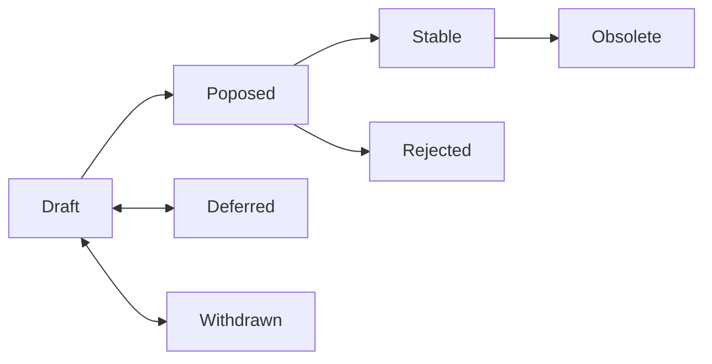

# IEP-0: IEP Purpose and Guidelines

| IEP:      | 0000                                       |
| --------- | ------------------------------------------ |
| Title:    | IEP Purpose and Guidelines                 |
| Author:   | Titusz Pan <tp@iscc.foundation>            |
| Comments: | https://github.com/iscc/iscc-ieps/issues/2 |
| Status:   | Draft                                      |
| Type:     | Process                                    |
| Created:  | 2022-08-28                                 |

## What is an IEP?

An ISCC Enhancement Proposal (IEP) is a design document providing information to the ISCC community,
or describing a new feature for the ISCC or its processes or environment. An IEP should provide a
concise technical specification of a feature and a rationale for the feature. IEPs have no special
status except that accorded by the community.

IEPs are a mechanism for proposing new features, for collecting community input on an issue, and for
documenting design decisions. The IEP author is responsible for building consensus within the
community and documenting dissenting opinions.

Because the IEPs are maintained as text files in a versioned repository, their revision history is
the historical record of the feature proposal.

## IEP Audience

The typical primary audience for IEPs are the developers of ISCC implementations.

However, other parts of the ISCC community may also choose to use the process (particularly for
Informational IEPs) to document expected API conventions and to manage complex design coordination
problems that require collaboration across multiple projects.

## IEP workflow

The IEP process begins with a new idea for the ISCC. Each potential IEP must have a champion -
someone who writes the IEP using the style and format described below, shepherds the discussions in
the appropriate forums, and attempts to build community consensus around the idea.

Small enhancements or patches to a particular piece of software often don't require coordination
between multiple projects or implementations; these don't need an IEP and should be injected into
the relevant project-specific development workflow with a patch submission to the applicable issue
tracker.

After investigating past work, the best way to proceed is by
[opening issue](https://github.com/iscc/iscc-ieps/issues/new) for discussion about the new idea.
Following a discussion, the proposal should be submitted to the
[IEPs git repository](https://github.com/iscc/iscc-ieps) as a pull request. This draft must be
written in IEP style as described below, and named with an alias such as
"iep-johndoe-new-semantic-id" until an editor has assigned it an IEP number (authors MUST NOT
self-assign IEP numbers).

When the IEP draft is complete, an IEP editor will assign the IEP a number, label it as Core,
Informational, or Process, and merge the pull request to the IEPs git repository. The IEP editors
will not unreasonably reject an IEP. Reasons for rejecting IEPs include duplication of effort,
disregard for formatting rules, being too unfocused or too broad, being technically unsound, not
providing proper motivation or addressing backwards compatibility. For an IEP to be accepted it must
meet certain minimum criteria. It must be a clear and complete description of the proposed
enhancement. The enhancement must represent a net improvement. The proposed implementation, if
applicable, must be solid and must not complicate the protocol unduly.

The IEP author may update the draft as necessary in the git repository. Updates to drafts should
also be submitted by the author as pull requests.

### Transferring IEP ownership

It occasionally becomes necessary to transfer ownership of IEPs to a new champion. A good reason to
transfer ownership is because the original author no longer has the time or interest in updating it
or following through with the IEP process, or is unreachable or not responding to email.

If you are interested in assuming ownership of an IEP, send a message asking to take over, addressed
to both the original author and the IEP editors. If the original author doesn't respond to email in
a timely manner, the IEP editors will make a unilateral decision.

### IEP Editors

The current IEP editors are:

- Titusz Pan <tp@iscc.foundation>

### IEP Editor Responsibilities

The IEP editors subscribe to the IEP issue tracker. Correspondence outside the issue tracker should
be sent (or CC'd) to the IEP editors.

For each new IEP that comes in an editor does the following:

- Read the IEP to check if it is ready: sound and complete. The ideas must make technical sense.

- The title should accurately describe the content.

- Motivation and backward compatibility (when applicable) must be addressed.

- Licensing terms must be acceptable for IEPs.

- If the IEP isn't ready, the editor will send it back to the author for revision, with specific
  instructions.

- Once the IEP is ready for the repository it should be submitted as a "pull request" to the IEPs
  git repository where it may get further feedback.

The IEP editor will:

- Assign an IEP number in the pull request.
- Merge the pull request when it is ready.
- List the IEP in README.md.

The IEP editors are intended to fulfill administrative and editorial responsibilities. The IEP
editors monitor IEP changes, and update IEP headers as appropriate.

## IEP format and structure

IEPs should be written in Markdown format.

Each IEP should have the following parts:

- Preamble - Headers containing metadata about the IEP (see below).
- Abstract - A short (~200 word) description of the issue being addressed.
- Motivation - A motivation section is critical for IEPs that want to change pre-existing
  specifications. It should clearly explain why the existing specification is inadequate to address
  the problem that the IEP solves. This section may be omitted if the motivation is evident.
- Specification - The specification should describe the syntax and semantics of any new feature. The
  specification should be detailed enough to allow competing, interoperable implementations.
- Rationale - The rationale fleshes out the specification by describing what motivated the design
  and why particular design decisions were made. It should describe alternate designs that were
  considered and related work. The rationale should provide evidence of consensus within the
  community and discuss important objections or concerns raised during discussion around the IEP.
- Backwards compatibility - All IEPs that introduce backwards incompatibilities must include a
  section describing these incompatibilities and their severity. The IEP must explain how the author
  proposes to deal with these incompatibilities.
- Reference implementation - A reference implementation must be completed before a Core IEP is given
  status Stable, but it need not be completed before the IEP is accepted. The stable implementation
  must include test code and documentation.
- Copyright Waiver - All IEPs must be in the public domain. The copyright waiver MUST link to the
  license file and use the following wording:
  `Copyright and related rights waived via [CC0](/LICENSE).`

### IEP header preamble

Each IEP must begin with a header preamble. The headers must appear in the following order. Headers
marked with "\*" are optional and are described below. All other headers are required.

```
  IEP: <IEP number, or "?" before being assigned>
  Title: <IEP title; maximum 44 characters>
  Author: <list of authors' names and email addresses>
  Comments: <link to issue page for comments>
  Status: <Draft | Deferred | Withdrawn | Proposed | Rejected | Stable | Obsolete>
  Type: <Core | Informational | Process>
  Created: <date created on, in ISO 8601 (yyyy-mm-dd) format>
  License: <abbreviation for approved license(s)>
* Replaces: <IEP number>
* Superseded-By: <IEP number>
```

The Author header lists the names and email addresses of all the authors/owners of the IEP. The
format of the Author header value must be

```
Random J. User <address@dom.ain>
```

If there are multiple authors, each should be on a separate line.

The Type header specifies the type of IEP: Core, Informational, or Process.

The Created header records the date that the IEP was assigned a number. Dates should be in
yyyy-mm-dd format, e.g. 2001-08-14.

IEPs may have a Superseded-By header indicating that an IEP has been rendered obsolete by a later
document; the value is the number of the IEP that replaces the current document. The newer IEP must
have a Replaces header containing the number of the IEP that it rendered obsolete.

## IEP Types

There are three kinds of IEPs:

- A **Core** IEP describes any change that affects most or all ISCC implementations, such as a
  change to the algorithms for creating ISCCs, or any change or addition that affects the
  interoperability of applications using the ISCC. Core IEPs consist of two parts, a design document
  and a reference implementation.
- An **Informational** IEP describes an ISCC design issue, or provides general guidelines or
  information to the ISCC community, but does not propose a new feature. Informational IEPs do not
  necessarily represent a ISCC community consensus or recommendation, so users and implementors are
  free to ignore Informational IEPs or follow their advice.
- A **Process** IEP describes a process surrounding ISCC, or proposes a change to (or an event in) a
  process. Process IEPs are like Core IEPs but apply to areas other than the ISCC algorithms itself.
  Examples include procedures, guidelines, changes to the decision-making process, and changes to
  the tools or environment used in ISCC development.

## IEP status

The typical paths of the status of IEPs are as follows:



Champions of an IEP may decide on their own to change the status between Draft, Deferred, or
Withdrawn. An IEP editor may also change the status to Deferred when no progress is being made on
the IEP.

An IEP may only change status from Draft to Proposed, when the author deems it is complete, has a
working implementation (where applicable), and has community plans to progress it to the Stable
status.

IEPs should be changed from Draft or Proposed status, to Rejected status, upon request by any
person, if they have not made progress in three years. Such an IEP may be changed to Draft status if
the champion provides revisions that meaningfully address public criticism of the proposal, or to
Proposed status if it meets the criteria required as described in the previous paragraph.

An IEP may change status from **Draft** to **Stable** when it achieves rough consensus on the issue
tracker and sufficient real-world adoption. Such a proposal is said to have rough consensus if it
has been open to discussion on the issue tracker for at least one month, and no person maintains any
unaddressed substantiated objections to it. Addressed or obstructive objections may be
ignored/overruled by general agreement that they have been sufficiently addressed, but clear
reasoning must be given in such circumstances.

Software authors are encouraged to publish summaries of what IEPs their software supports to aid in
verification of status changes.

Should an IEP become actually and unambiguously adopted despite not meeting the criteria outlined
here, it should still be updated to Stable status.

When a Stable IEP is no longer relevant, its status may be changed to Obsolete. This change must
also be objectively verifiable and/or discussed.

## History

This document was derived heavily from Bitcoin’s BIP-0002 which in turn was derived from Python’s
PEP-0001. In many places text was simply copied and modified. The original authors of BIP-0002 and
PEP-0001 are not responsible for its use in the ISCC Enhancement Proposals, and should not be
bothered with technical questions specific to ISCC or the IEPs. Please direct all comments to the
IEP editors.

## Copyright

Copyright and related rights waived via
[CC0](https://creativecommons.org/publicdomain/zero/1.0/legalcode).
