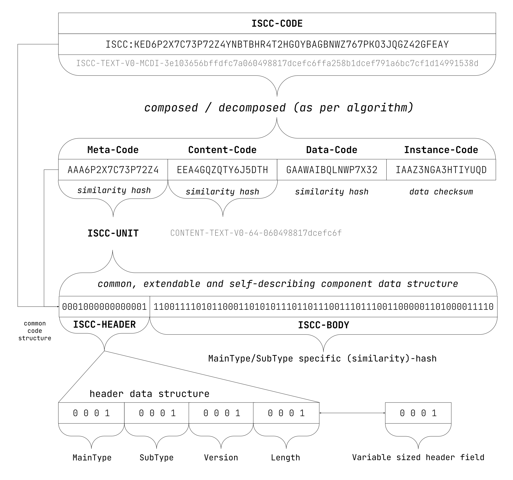

# ISCC Structure and Format

| IEP:      | 0001                                       |
|-----------|--------------------------------------------|
| Title:    | ISCC Structure and Format                  |
| Author:   | Titusz Pan <tp@iscc.foundation>            |
| Comments: | https://github.com/iscc/iscc-ieps/issues/6 |
| Status:   | Draft                                      |
| Type:     | Core                                       |
| License:  | CC-BY-4.0                                  |
| Created:  | {{ git_creation_date_localized }}          |
| Updated:  | {{ git_revision_date_localized }}          |

!!! note

    This document is a **DRAFT** contributed as input to 
    [ISO TC 46/SC 9/WG 18](https://www.iso.org/committee/48836.html). The final version is 
    developed at the International Organization for Standardization as
    [ISO/AWI 24138](https://www.iso.org/standard/77899.html)

## Abstract

This document describes the coding scheme for the International Standard Content Code (ISCC).

## Motivation

The ISCC is a similarity preserving identifier for all kinds of digital content.
As such the ISCC requires a universal coding scheme to meet a broad set of use cases and support
different media types. Thecoding scheme for all ISCCs should be:

1. compact

- interoperable
- modular
- extensible
- self-describing

## General structure of ISCC

1. An ISCC shall be composed of an ISCC-HEADER and an ISCC-BODY.
2. The ISCC-HEADER shall describe the MainType, SubType, Version, and Length of its ISCC-BODY.
3. An ISCC-UNIT shall be an ISCC based on one specific algorithm.
4. An ISCC-CODE shall be an ISCC composed of two or more different ISCC-UNITs.

<figure markdown>
  { width="1000px" }
  <figcaption>Figure 1 - General Structure of an ISCC</figcaption>
</figure>

## ISCC-HEADER

The ISCC-HEADER is a variable sized bitstream composed of an ordered sequence of the 4 header-fields
MainType, SubType, Version, Length.

Each header-field is a bitstream with a length between 4 and 16 bits and encodes an integer value
between 0 and 4679 with the following encoding scheme:

1. The total bit-length of a header-field shall be determined by its prefix-bits.

- The prefix-bits shall be followed by data-bits.
- The data-bits shall be interpreted as unsigned integer values plus the maximum value of the
  preceding range.
- If the total length of all header-fields in number of bits is not divisible by 8, the header shall
  be padded with 4 zero bits (0000) on the right side.

**Table 1 – Variable length ISCC-HEADER field encoding**
{: style="text-align:center; font-size:smaller" }

| **Prefix bits** | **Number of nibbles** | **Number of data bits** | **Integer range** |
|-----------------|-----------------------|-------------------------|-------------------|
| 0               | 1                     | 3                       | 0-7               |
| 10              | 2                     | 6                       | 8-71              |
| 110             | 3                     | 9                       | 72-583            |
| 1110            | 4                     | 12                      | 584-4679          |

!!! example "Header-field examples"

    ```
    0 = 0000
    1 = 0001
    …
    7 = 0111
    8 = 1000 0000
    9 = 1000 0001
    ```

The interpretation of the integer value of a header-field shall be context dependent:

1. For the MainType and SubType fields it shall be an identifier for the designated type.

- For the Version field it shall be the literal version number.
- For the Length field of ISCC-UNITs it shall be a number used as a multiplier to calculate the bit
  length of the ISCC-BODY.
- For the Length field of ISCC-CODEs it shall be a bit-pattern encoding the combination of
  ISCC-UNITs and the bit-length of the ISCC-BODY.

### MainTypes

The MainType header-field shall signify the type of the ISCC.

Backward incompatible updates to an algorithm associated with a MainType shall be indicated by
incrementing the version field of the ISCC-HEADER of the respective MainType.

!!! note

    The first edition of the standard specifies initial algorithms (version 0) for all reserved
    MainTypes except for the SEMANTIC type which is not currently defined.

**Table 2 – Reserved ISCC MainTypes**
{: style="text-align:center; font-size:smaller" }

| **ID** | **Symbol** | **Bits** | **Definition**                                                                      |
|--------|------------|----------|-------------------------------------------------------------------------------------|
| 0      | META       | 0000     | An ISCC-UNIT that matches on metadata similarity                                    |
| 1      | SEMANTIC   | 0001     | An ISCC-UNIT that matches on semantic content similarity                            |
| 2      | CONTENT    | 0010     | An ISCC-UNIT that matches on perceptual content similarity                          |
| 3      | DATA       | 0011     | An ISCC-UNIT that matches on data similarity                                        |
| 4      | INSTANCE   | 0100     | An ISCC-UNIT that matches on data identity                                          |
| 5      | ISCC       | 0101     | An ISCC-CODE composed of two or more headerless ISCC-UNITs for multi-modal matching |

### SubTypes

The MainTypes META, DATA, and INSTANCE shall have a single default SubType NONE encoded with the
bits 0000.

The MainTypes SEMANTIC, CONTENT, and ISCC shall have SubTypes that signify the perceptual mode.

**Table 3 – Reserved SubTypes for MainTypes ISCC, SEMANTIC, and CONTENT**
{: style="text-align:center; font-size:smaller" }

| **ID** | **Symbol** | **Bits** | **Definition**                  |
|--------|------------|----------|---------------------------------|
| 0      | TEXT       | 0000     | Match on text similarity        |
| 1      | IMAGE      | 0001     | Match on image similarity       |
| 2      | AUDIO      | 0010     | Match on audio similarity       |
| 3      | VIDEO      | 0011     | Match on video similarity       |
| 4      | MIXED      | 0100     | Match on multi-modal similarity |

**Table 4 – Additional Reserved SubTypes for the MainType ISCC**
{: style="text-align:center; font-size:smaller" }

| **ID** | **Symbol** | **Bits** | **Definition**                                                 |
|--------|------------|----------|----------------------------------------------------------------|
| 5      | SUM        | 0101     | Composite of ISCC-UNITs including only Data- and Instance-Code |
| 6      | NONE       | 0110     | Composite ISCC-UNITs including Meta-, Data- and Instance-Code  |

### Version

All ISCC-HEADERs shall have a version header-field of 0000 for the first edition of the standard.

**Table 5 – Reserved ISCC Versions**
{: style="text-align:center; font-size:smaller" }

| **ID** | **Symbol** | **Bits** | **Definition**                              |
|--------|------------|----------|---------------------------------------------|
| 0      | V0         | 0000     | Initial version of ISCC-UNITs and ISCC-CODE |

### Length

The encoding of the Length header-field shall be specific to the MainType.

#### Length of ISCC-UNITs

For ISCC-UNITs of the MainTypes META, SEMANTIC, CONTENT, DATA, and INSTANCE the length value shall
be encoded as the number of 32-bit blocks of the ISCC-BODY in addition to the minimum length of 32
bits.

**Table 6 – Reserved length field values (multiples of 32 bit)**
{: style="text-align:center; font-size:smaller" }

| **ID** | **Symbol** | **Bits** | **Definition**                             |
|--------|------------|----------|--------------------------------------------|
| 0      | L32        | 0000     | Length of body is 32 bits (minimum length) |
| 1      | L64        | 0001     | Length of body is 64 bits (default length) |
| 2      | L96        | 0010     | Length of body is 96 bits                  |
| 3      | L128       | 0011     | Length of body is 128 bits                 |
| 4      | L160       | 0100     | Length of body is 160 bits                 |
| 5      | L192       | 0101     | Length of body is 192 bits                 |
| 6      | L224       | 0110     | Length of body is 224 bits                 |
| 7      | L256       | 0111     | Length of body is 256 bits                 |

#### Length of ISCC-CODEs

1. For ISCC-CODEs the length value shall designate the composition of ISCC-UNITs.

2. The Data-Code and Instance-Code shall be mandatory 64-bit components of an ISCC-CODE.

3. The first data-bit shall designate the presence of a 64-bit Meta-Code.

4. The second data-bit shall designate the presence of a 64-bit Semantic-Code.

5. The third data-bit shall designate the presence of a 64-bit Content-Code.

6. The length of an ISCC-CODE shall be calculated as the number of active data-bits times 64 plus
   128 bits of mandatory data.

**Table 7 – Reserved length field values (for MainType ISCC)**
{: style="text-align:center; font-size:smaller" }

| **ID** | **Symbol** | **Bits** | **Definition**                                                   |
|--------|------------|----------|------------------------------------------------------------------|
| 0      | SUM        | 0000     | No optional ISCC-UNITs. Length of body is 128 bits.              |
| 1      | CDI        | 0001     | Includes Content-Code. Length of body is 192 bits                |
| 2      | SDI        | 0010     | Includes Semantic-Code. Length of body is 192 bits               |
| 3      | SCDI       | 0011     | Includes Semantic- and Content-Code. Length of body is 256 bits  |
| 4      | MDI        | 0100     | Includes Meta-Code. Length of body is 192 bits                   |
| 5      | MCDI       | 0101     | Includes Meta-Code and Content-Code. Length of body is 256 bits  |
| 6      | MSDI       | 0110     | Includes Meta-Code and Semantic-Code. Length of body is 256 bits |
| 7      | MSCDI      | 0111     | Includes Meta-, Semantic-, and Content-Code. Length is 320 bits  |

## ISCC-BODY

1. The preceding MainType, SubType, and Version fields shall qualify the semantics of an ISCC-BODY.
2. The Length field shall determine the number of bits of an ISCC-BODY.

## Encoding of ISCC

### Canonical form

The printable canonical form of an ISCC shall be its RFC 4648 Base32 encoded representation without
padding and prefixed with “ISCC:”.

!!! example "Canonical ISCC-CODE example"

    ISCC:KEC43HJLPUSHVAZT66YLPUWNVACWYPIV533TRQMWF2IUQYSP5LA4CTY

### URI encoding

1. An ISCC shall be encodable as a Uniform Resource Identifier (URI) according to RFC 3986.
2. The URI representation shall have the format `<scheme>:<path>`.
3. The URI scheme shall be the string “iscc”.
4. The URI path shall be the lower-cased base32 representation of an ISCC without padding.

!!! example "URI encoded ISCC-CODE example"

    iscc:kec43hjlpushvazt66ylpuwnvacwypiv533trqmwf2iuqysp5la4cty

### Multiformats encoding

1. The ISCC shall be encodable as
   a [multibase](https://datatracker.ietf.org/doc/html/draft-multiformats-multibase-06) string.
2. The [multicodec](https://github.com/multiformats/multicodec/blob/master/table.csv) identifier of
   an ISCC shall be `0xcc01`.
3. A [Multiformat](https://multiformats.io/) representation of an ISCC shall be prefixed with a
   Multibase code.
4. The encoding scheme shall be `<multibase><multicodec><iscc-header><iscc-body>`.

ISCC shall support the following multibase encodings:

**Table 8 – Supported multibase encodings**
{: style="text-align:center; font-size:smaller" }

| **Encoding** | **Code** | **Definition**                        |
|--------------|----------|---------------------------------------|
| base16       | f        | hexadecimal                           |
| base32       | b        | RFC4648 case-insensitive - no padding |
| base32hex    | v        | Match on audio similarity             |
| base58btc    | z        | base58 bitcoin                        |
| base64url    | u        | RFC4648 no padding                    |

**Table 9 – Examples of ISCCs in multiformats encoding**
{: style="text-align:center; font-size:smaller" }

| **Encoding** | **Example**                                                               |
|--------------|---------------------------------------------------------------------------|
| MF base16    | fcc015105cd9d2b7d247a8333f7b0b7d2cda8056c3d15eef738c1962e9148624feac1c14f |
| MF base32    | bzqavcbontuvx2jd2qmz7pmfx2lg2qblmhuk655zyyglc5ekimjh6vqobj4               |
| MF base32hex | vpg0l21edjklnq93qgcpvfc5nqb6qg1bc7kauttpoo6b2t4a8c97ulge19s               |
| MF base58btc | z2Yr3BMx3Rj56fyYkNvfa19PCk4SjspQhpVWoLSGg9yXr4vUGsx                       |
| MF base64url | uzAFRBc2dK30keoMz97C30s2oBWw9Fe73OMGWLpFIYk_qwcFP                         |

### Readable encoding

1. The ISCC shall be encodable in human-readable representation.
2. The readable representation shall encode the header-fields with their symbols and the ISCC-BODY
   in base16 lower-case.
3. The header-fields and the ISCC-BODY shall be separated with hyphens.

!!! example "Example of human-readable ISCC-CODE"

    ISCC-IMAGE-V0-MCDI-cd9d2b7d247a8333f7b0b7d2cda8056c3d15eef738c1962e9148624feac1c14f

## Reference implementation

The reference implementation of this coding scheme is published in the
[iscc-core](https://github.com/iscc/iscc-core/) python package in the
[codec.py](https://github.com/iscc/iscc-core/blob/main/iscc_core/codec.py) module.
