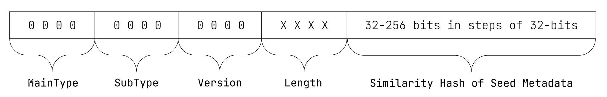
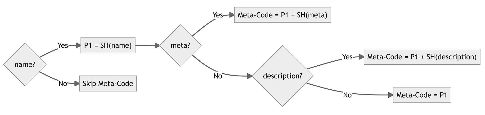
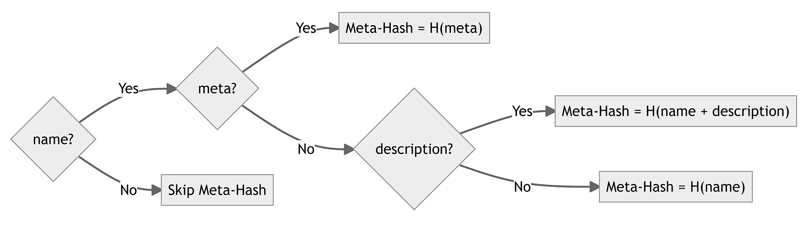

# ISCC-UNIT Meta-Code

| IEP:      | 0002                                       |
|-----------|--------------------------------------------|
| Title:    | ISCC-UNIT Meta-Code                        |
| Author:   | Titusz Pan <tp@iscc.foundation>            |
| Comments: | https://github.com/iscc/iscc-ieps/issues/7 |
| Status:   | Draft                                      |
| Type:     | Core                                       |
| License:  | CC-BY-4.0                                  |
| Created:  | {{ git_creation_date_localized }}          |
| Updated:  | {{ git_revision_date_localized }}          |

!!! note

    This document is a **DRAFT** contributed as input to 
    [ISO TC 46/SC 9/WG 18](https://www.iso.org/committee/48836.html). The final version is 
    developed at the International Organization for Standardization as
    [ISO/DIS 24138](https://www.iso.org/standard/77899.html)

## General

The Meta-Code is a similarity hash generated from referent seed metadata as defined in 
[IEP-0012](./iep-0012.md)

## Purpose

The Meta-Code shall support the following use cases:

1. clustering of digital assets based on their metadata;
2. discovery of digital assets with similar metadata;
3. verification or manual disambiguation of matching codes.

## Format

The Meta-Code shall have the data format as illustrated in Figure 2:

<figure markdown>
  
  <figcaption>Figure 2 - Data format of the Meta-Code</figcaption>
</figure>

!!! example "EXAMPLE: 64-bit Meta-Code in its canonical form:"

    ISCC:AAAUL6P7RMVNT4UJ

!!! example "EXAMPLE: 256-bit Meta-Code in its canonical form:"

    ISCC:AADUL6P7RMVNT4UJJ4SMTDXBL5JFZ5XPCDKO42XYPJEVQ4L7PTYDORQ

## Inputs

Seed metadata is the metadata that is used as the input to calculate the Meta-Code and has three 
possible elements:

1. name (required): the name or title of the work manifested by the digital asset;
2. description (optional): a disambiguating textual description of the digital asset;
3. meta (optional): subject, industry, or use-case specific metadata.

!!! note "NOTE 1"
    
    Because seed metadata is used to construct the Meta-Code, changes to its value may produce 
    different (and therefore no longer matching) Meta-Codes. Seed metadata is stored and carried 
    along unaltered with ISCC Metadata if automated verification of the Meta-Code based on the 
    original seed metadata is required.

!!! note "NOTE 2"
    
    The identifier standards and their schemas defined by ISO/TC 46/SC 9 provide helpful guidance 
    in selecting seed metadata.

### name element

The text input for the name element shall be pre-processed before similarity hashing as follows:

1. Apply ISO/IEC 10646 NFKC Unicode Normalization  (see Unicode Normalization Forms https://unicode.org/reports/tr15/#Norm_Forms). 
2. Remove control characters (see Unicode Character Database https://www.unicode.org/ucd/). 
3. Strip leading and trailing whitespace. 
4. Trim the end of the text such that the UTF-8 encoded size does not exceed 128 bytes.

### description element

Text input for the description element shall be pre-processed before similarity hashing as follows:

1. Apply NFKC Unicode Normalization.
2. Remove control characters (as specified by Unicode Character Database) except for the following newline characters:
    - U000A - Line Feed;
    - U000B - Vertical Tab;
    - U000C - Form Feed;
    - U000D - Carriage Return;
    - U0085 - Next Line;
    - U2028 - Line Separator;
    - U2029 - Paragraph Separator.
3. Collapse more than two consecutive newlines characters to a maximum of two consecutive newlines.
4. Strip leading and trailing whitespace characters.

### meta element
1. The value of the meta element shall be wrapped in a RFC 2397 Data-URL.
2. The value of the meta element may include any conceivable and supportive metadata such as for example:
    - JSON serialized metadata (`data:application/json;base64,<data>`);
    - JSON-LD serialized metadata (`data:application/ld+json;base64,<data>`);
    - XML serialized metadata (`data:application/xml;base64,<data>`);
    - MARC21 XML (`data:application/xml;base64,<data>`);
    - IPTC NewsML (`data:application/vnd.iptc.g2.newsitem+xml;base64,<data>`);
    - a file header (`data:application/octet-stream;base64,<data>`);
    - a thumbnail image (`data:image/png;base64,<data>`);
    - an audio sample (`data:audio/mp4;base64,<data>`).
3. If the value of the meta element is JSON or JSON-LD it shall be serialized with RFC 8785 JCS canonicalization before being wrapped in a Data-URL.
4. If the value of the meta element is XML it shall be serialized as Canonical XML.
5. The Data-URL shall be pre-processed before similarity hashing as follows:
    1. Decode the base64 encoded data section of the Data URL to a raw bitstream without further interpretation.

## Outputs

Meta-Code processing shall generate the following output elements for inclusion into the produced 
ISCC metadata:

1. iscc (required): the ISCC Meta-Code in its canonical form;
2. name (required): the pre-processed value of the name element;
3. meta (optional): the unaltered value of the meta element;
4. description (optional): the pre-processed value of the description element;
5. metahash (required): a cryptographic hash of the seed metadata.

!!! note "NOTE 1"

    The reference implementation uses a multihash [^1] encoded BLAKE3 [^2] value for the metahash element.

!!! note "NOTE 2"

    An ISCC processor may produce other custom output elements, which are helpful to identify the digital asset.

## Seed metadata

### Meta-Code processing

The Meta-Code shall be constructed from 2 similarity hashes interleaved in 32-bit chunks by 
selecting the elements according to the algorithm illustrated in Figure 3.

<figure markdown>
  
  <figcaption>Figure 3 - Meta-Code processing logic</figcaption>
</figure>

1. If the name element is unavailable, Meta-Code generation shall be skipped.
2. The first part of the similarity hash for the Meta-Code shall be generated from the name element.
3. The second part of the similarity hash shall be generated from the meta element. 
4. If the meta element is unavailable, the second part of the similarity hash shall be generated from the description element.
5. If the description element is unavailable, the second part of the similarity hash shall also be generated from the name element.

### Meta-Hash processing

The Meta-Hash shall be constructed from the seed metadata by selecting input elements according to 
the algorithm illustrated in Figure 4.

<figure markdown>
  
  <figcaption>Figure 4 - Meta-Hash processing logic</figcaption>
</figure>

1. If the name element is unavailable, Meta-Hash generation shall be skipped.
2. If the meta element is available, the decoded raw and un-interpreted data of the Data-URL shall be used as sole input to the cryptographic hash function.
3. If the meta element is unavailable, but the description element is available, the space-concatenated value of the pre-processed name and description shall be the input to the cryptographic hash function.
4. If only the name element is available, its pre-processed value shall be the input to the cryptographic hash function.

## Metadata embedding

1. Seed metadata shall be embedded into the processed digital asset if:
    1. seed metadata values have been provided explicitly to an ISCC processor;
    2. the ISCC processor supports metadata embedding for the given media type.
2. If the media type supports ISO 16684 XMP metadata-embedding, an ISCC processor shall use the namespace http://purl.org/iscc/schema and embed seed metadata values under the names:
    1. Xmp.iscc.name
    2. Xmp.iscc.description
    3. Xmp.iscc.meta
3. If the media type does not support ISO 16684 XMP metadata-embedding the ISCC processor may choose other suitable format-specific fields for embedding seed metadata.
4. If seed metadata is to be embedded, it shall be embedded before processing other ISCC-UNITs.
5. An ISCC processor should document for which media types it supports metadata-embedding and how it maps seed metadata to format specific elements.

## Metadata extraction

1. An ISCC processor shall try to extract seed metadata from the digital asset if:
    1. seed metadata has not been provided explicitly to the ISCC processor;
    2. the ISCC processor supports metadata extraction for the given media type.
2. Seed metadata shall be extracted with the following precedence:
    1. Extract seed metadata from XMP metadata under the namespace http://purl.org/iscc/schema.
    2. Extract seed metadata from suitable, format-specific embedded metadata.
    3. Use the filename of the asset as a value for the name element, discarding the file extension and replacing the characters “-” and “_” with spaces.
    4. An ISCC processor shall document for which media types it supports metadata-extraction and how it maps seed metadata to format specific elements.

**Bibliography**

[^1]: IETF, draft-multiformats-multihash-05 — *The Multihash Data Format*  
Available at https://datatracker.ietf.org/doc/html/draft-multiformats-multihash-05

[^2]: O’Connor, J., Aumasson, J.P., Neves, S., Wilcox-O’Hearn, Z., *BLAKE3: one function, fast 
everywhere.* Version 20211102173700, accessed July 2022.  
Available at https://github.com/BLAKE3-team/BLAKE3-specs/blob/master/blake3.pdf

