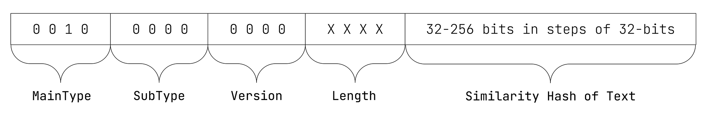

# ISCC-UNIT Content-Code Text

| IEP:      | 0003                                       |
|-----------|--------------------------------------------|
| Title:    | ISCC-UNIT Condent-Code Text                |
| Author:   | Titusz Pan <tp@iscc.io>                    |
| Comments: | https://github.com/iscc/iscc-ieps/issues/8 |
| Status:   | DRAFT                                      |
| Type:     | Core                                       |
| License:  | CC-BY-4.0                                  |
| Created:  | {{ git_creation_date_localized }}          |
| Updated:  | {{ git_revision_date_localized }}          |

!!! note

    This document is a **DRAFT** contributed as input to 
    [ISO TC 46/SC 9/WG 18](https://www.iso.org/committee/48836.html). The final version is 
    developed at the International Organization for Standardization as
    [ISO/DIS 24138](https://www.iso.org/standard/77899.html)

## General

1. The Content-Code Subtype Text (Text-Code) shall be a Content-Code generated from the plain text content extracted from a digital asset that contains text.
2. The Text-Code shall be robust against text document format conversion and minor edits.

## Format

The Text-Code shall have the data format illustrated in Figure 5.

<figure markdown>
  
  <figcaption>Figure 5 - Data format of the Text-Code</figcaption>
</figure>

!!! example "EXAMPLE 1: 64-bit Text-Code in its canonical form with text input “Hello World”:"

    ISCC:EAASKDNZNYGUUF5A

!!! example "EXAMPLE 2: 256-bit Text-Code in its canonical form with text input “Hello World”:"

    ISCC:EADSKDNZNYGUUF5AMFEJLZ5P66CP5YKCOA3X7F36RWE4CIRCBTUWXYY

## Inputs

1. The input for calculating the Text-Code shall be the plain text as extracted from a digital document.
2. An ISCC implementation may use any text extraction mechanism, including optical character recognition, to extract plain text from a digital document.
3. Plain text used as input for Text-Code calculation shall not include any processing instructions (SGML, HTML, Markdown, and other markup information).

## Outputs

Text-Code processing shall generate the following ISCC metadata output elements:

1. iscc: the Text-Code in its canonical form (required);
2. characters: The number of characters of the source text after pre-processing (optional);
3. Additional metadata extracted from the document (optional).

## Processing

An ISCC processor shall pre-process Text input as follows:

1. Apply NFD Unicode Normalization.
2. Remove all whitespace characters from the text.
3. Convert text to lower case in accordance with Unicode ‘Case Folding Properties’ (see https://www.unicode.org/Public/UCD/latest/ucd/CaseFolding.txt). 
4. Remove all characters from Unicode categories Mark (M), Punctuation (P) and Other (C).
5. Apply NFKC Unicode Normalization.
 
An ISCC processor shall calculate the Text-Code as follows:

1. Split the pre-processed text into n-grams of 13 characters by sliding over the text character-wise.
2. Create a list of 32-bit unsigned integers by hashing the UTF-8 encoded representation of the n-grams using the XXH32 algorithm.
3. Apply the Minhash256 algorithm to the list of integers to calculate the ISCC-BODY of the Text-Code.

## Conformance

The normative behaviour of an ISCC processor in generating a Text-Code is specified only for UTF-8 
encoded text input. An implementation of the Text-Code algorithm shall be regarded as conforming to 
the standard as long as it creates the same Text-Code as the reference implementation for the same 
UTF-8 encoded text input.

The normative behaviour of an ISCC processor in generating a Text-Code from other sources is not 
specified and different codes can be generated depending on the tools used for text extraction from 
the source. Implementers seeking to guarantee interoperability with each other in these 
circumstances should select the same tool for text extraction.

!!! note "NOTE"

    For further technical details see source-code in the modules 
    [code_content_text.py](https://github.com/iscc/iscc-core/blob/main/iscc_core/code_content_text.py) 
    and [minhash.py](https://github.com/iscc/iscc-core/blob/main/iscc_core/minhash.py) of the 
    [reference implementation](https://github.com/iscc/iscc-core).
