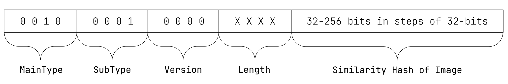

# ISCC-UNIT Content-Code Image

| IEP:      | 0004                                       |
|-----------|--------------------------------------------|
| Title:    | ISCC-UNIT Condent-Code Image               |
| Author:   | Titusz Pan <tp@iscc.io>                    |
| Comments: | https://github.com/iscc/iscc-ieps/issues/9 |
| Status:   | DRAFT                                      |
| Type:     | Core                                       |
| License:  | CC-BY-4.0                                  |
| Created:  | {{ git_creation_date_localized }}          |
| Updated:  | {{ git_revision_date_localized }}          |

!!! note

    This document is a **DRAFT** contributed as input to 
    [ISO TC 46/SC 9/WG 18](https://www.iso.org/committee/48836.html). The final version is 
    developed at the International Organization for Standardization as
    [ISO/DIS 24138](https://www.iso.org/standard/77899.html)

## General

1. The Content-Code Subtype Image (Image-Code) shall be a perceptual similarity hash of the input image.
2. The Image-Code shall be robust against image format conversion, scaling, compression and minor edits.

## Format

The Image-Code shall have the data format illustrated in Figure 6.

<figure markdown>
  
  <figcaption>Figure 6 - Data format of the Image-Code</figcaption>
</figure>

!!! example "EXAMPLE 1: 64-bit Image-Code in its canonical form:"

    ISCC:EEA4GQZQTY6J5DTH

!!! example "EXAMPLE 2: 256-bit Image-Code in its canonical form:"

    ISCC:EED4GQZQTY6J5DTHQ2DWCPDZHQOM6QZQTY6J5DTFZ2DWCPDZHQOMXDI

## Inputs

1. The input for calculating the Image-Code shall be an image file.
2. An ISCC processor shall at least support the JPEG and PNG image formats.

## Outputs

Image-Code processing shall generate the following ISCC metadata output elements:

1. iscc: the Image-Code in its canonical form (required);
2. width: width of the original input image in number of pixels (optional);
3. height: height of the original input image in number of pixels (optional);
4. thumbnail: a thumbnail of the original image encoded as Data-URL (optional);
5. Additional metadata extracted from the image (optional).

## Processing

An ISCC processor shall pre-process the image file input as follows:

1. Transpose the image according to its orientation tag (if available).
2. Add white background to image if it contains alpha transparency.
3. Crop uniformly colored borders if applicable.
4. Convert image to grayscale.
5. Resize grayscale image to 32x32 pixels using bicubic interpolation.

An ISCC processor shall calculate the Image-Code as follows:

1. Apply discrete cosine transform to the 32x32 grayscale pixel matrix.
2. Calculate the median value of the upper left 8x8 pixels of the transformed matrix.
3. For each pixel of the upper-left 8x8 square set a 1-bit if the grayscale value is larger than the median and a 0-bit if it is smaller or equal to the median value.
4. The collected bits are the first 64 bits of the body of the Image-Code.
5. To extend the perceptual hash up to 256 bits repeat steps 2-3 for the top-right, bottom-left and bottom-right 8x8 squares in the given order.

## Conformance

The normative behaviour of an ISCC processor in generating an Image–Code is specified only for the 
pre-processed 32x32 pixel grayscale input. An implementation of the Image-Code algorithm shall be 
regarded as conforming to the standard if it creates the same Image-Code as the reference 
implementation for the same 32x32 grayscale pixel values. 

Implementers seeking to guarantee interoperability with each other in these circumstances should 
select the same tool for image pre-processing. 

!!! note "NOTE"

    For further technical details see source-code in modules 
    [code_content_image.py](https://github.com/iscc/iscc-core/blob/main/iscc_core/code_content_image.py) 
    and [dct.py](https://github.com/iscc/iscc-core/blob/main/iscc_core/dct.py) of
    the [reference implementation](https://github.com/iscc/iscc-core).
