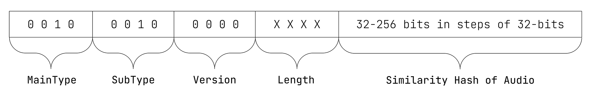

# ISCC-UNIT Content-Code Audio

| IEP:      | 0005                                        |
|-----------|---------------------------------------------|
| Title:    | ISCC-UNIT Condent-Code Audio                |
| Author:   | Titusz Pan <tp@iscc.foundation>             |
| Comments: | https://github.com/iscc/iscc-ieps/issues/10 |
| Status:   | DRAFT                                       |
| Type:     | Core                                        |
| License:  | CC-BY-4.0                                   |
| Created:  | {{ git_creation_date_localized }}           |
| Updated:  | {{ git_revision_date_localized }}           |

!!! note

    This document is a **DRAFT** contributed as input to 
    [ISO TC 46/SC 9/WG 18](https://www.iso.org/committee/48836.html). The final version is 
    developed at the International Organization for Standardization as
    [ISO/DIS 24138](https://www.iso.org/standard/77899.html)

## General

1. The Content-Code Subtype Audio (Audio-Code) shall be a similarity hash of the audio input.
2. The Audio-Code shall be robust against audio format conversion, compression, and minor edits.

## Format

The Audio-Code shall have the data format illustrated in Figure 7.

<figure markdown>
  
  <figcaption>Figure 7 - Data format of the Audio-Code</figcaption>
</figure>

!!! example "EXAMPLE 1: 64-bit Audio-Code in its canonical form:"

    ISCC:EIAWUJFCEZZOJYVD

!!! example "EXAMPLE 2: 256-bit Audio-Code in its canonical form:"

    ISCC:EIDWUJFCEZZOJYVDHJHIRB3KQSQCM2REUITDUTVAQNRGJIRENCCCULY

## Inputs

The input for calculating the Audio-Code shall be the Chromaprint fingerprint (array of 32-bit 
signed integers) from the original audio data.

## Outputs

Audio-Code processing shall generate the following ISCC metadata output elements:

1. iscc: the Audio-Code in its canonical form (required).
2. duration: duration of audio in seconds (optional).
3. Additional metadata extracted from the audio file (optional).

## Processing

An ISCC processor shall calculate the Audio-Code as follows:

1. Calculate a 32-bit similarity hash from the input array.
2. Additionally, calculate 32-bit similarity hashes separately for each quarter of values from the input array and concatenate them to the result from step 1 in order to extend the similarity hash up to a total of 160 bits. 
3. Sort the input array by value in ascending order and calculate similarity hashes separately for each third of the values and concatenate them to the result from step 2 in order to extend the similarity hash of the final ISCC-BODY of the Audio-Code up to the maximum of 256 bits.

## Conformance

The normative behaviour of an ISCC processor in generating an Audio–Code is specified only for the
Chromaprint input array.  An implementation of the Audio-Code algorithm shall be regarded as 
conforming to the standard if it creates the same Audio-Code as the reference implementation for 
the same Chromaprint array of 32-bit values.

!!! note "NOTE"

    For further technical details see source-code in modules 
    [code_content_audio.py](https://github.com/iscc/iscc-core/blob/main/iscc_core/code_content_audio.py) 
    and [simhash.py](https://github.com/iscc/iscc-core/blob/main/iscc_core/simhash.py) of the 
    [reference implementation](https://github.com/iscc/iscc-core).
