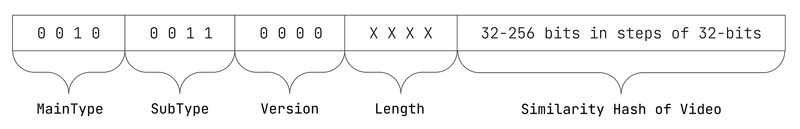

# ISCC-UNIT Content-Code Video

| IEP:      | 0006                                        |
|-----------|---------------------------------------------|
| Title:    | ISCC-UNIT Condent-Code Video                |
| Author:   | Titusz Pan <tp@iscc.io>                     |
| Comments: | https://github.com/iscc/iscc-ieps/issues/11 |
| Status:   | DRAFT                                       |
| Type:     | Core                                        |
| License:  | CC-BY-4.0                                   |
| Created:  | {{ git_creation_date_localized }}           |
| Updated:  | {{ git_revision_date_localized }}           |

!!! note

    This document is a **DRAFT** contributed as input to 
    [ISO TC 46/SC 9/WG 18](https://www.iso.org/committee/48836.html). The final version is 
    published under [ISO 24138:2024](https://www.iso.org/standard/77899.html).

## General

1. The Content-Code Subtype Video (Video-Code) shall be a similarity hash of the input video.
2. The Video-Code shall be robust against format conversions, scaling, compression, changes of framerate and minor edits.

## Format

The Video-Code shall have the data format illustrated in Figure 8.

<figure markdown>
  
  <figcaption>Figure 8 - Data format of the Video-Code</figcaption>
</figure>

!!! example "EXAMPLE 1: 64-bit Video-Code in its canonical form:"

    ISCC:EMA7KERCWROEVL6F

!!! example "EXAMPLE 2: 256-bit Video-Code in its canonical form:"

    ISCC:EMD7KERCWROEVL6FU3SISZAZPJCBAZKXEZLZTSRQPGASTENCMSYFOAY

## Inputs

The input for calculation of the Video-Code shall be the MPEG-7 video frame signatures, as specified
in ISO/IEC 15938, from the original video data.

## Outputs

Video-Code processing shall generate the following ISCC metadata output elements:

1. iscc: the Video-Code in its canonical form (required);
2. width: width of the original input video in number of pixels (optional);
3. height: height of the original input video in number of pixels (optional);
4. duration: duration of video in seconds (optional);
5. fps: frames per second of the original video (optional);
6. thumbnail: a thumbnail from the original video encoded as Data-URL (optional);
7. Additional metadata extracted from the video (optional).

## Processing

An ISCC processor shall pre-process the video file input as follows:

1.  Generate the MPEG-7 video signature at 5 frames per second.

An ISCC processor shall calculate the Video-Code as follows:

1. For each of the 380 integer values of the MPEG-7 frame signature calculate its sum over all frames.
2. Apply WTA hash to the resulting array of 380 integer values to calculate the ISCC-BODY of the Video-Code at the desired bit-length.

The normative behaviour of an ISCC processor in generating a Video–Code is specified only for the 
MPEG 7 video frame signature input.  An implementation of the Video-Code algorithm shall be 
regarded as conforming to the standard if it creates the same Video-Code as the reference 
implementation for the same MPEG 7 video frame signature input.

!!! note "NOTE"

    For further technical details see source-code in modules 
    [code_content_video.py](https://github.com/iscc/iscc-core/blob/main/iscc_core/code_content_video.py)
    and [wtahash.py](https://github.com/iscc/iscc-core/blob/main/iscc_core/wtahash.py) of the 
    [reference implementation](https://github.com/iscc/iscc-core).
