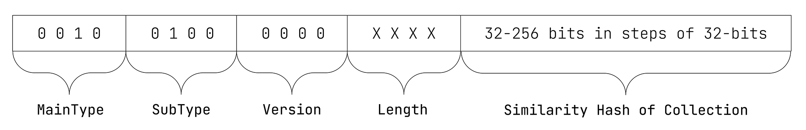

# ISCC-UNIT Content-Code Mixed

| IEP:      | 0007                                        |
|-----------|---------------------------------------------|
| Title:    | ISCC-UNIT Condent-Code Mixed                |
| Author:   | Titusz Pan <tp@iscc.io>                     |
| Comments: | https://github.com/iscc/iscc-ieps/issues/12 |
| Status:   | DRAFT                                       |
| Type:     | Core                                        |
| License:  | CC-BY-4.0                                   |
| Created:  | {{ git_creation_date_localized }}           |
| Updated:  | {{ git_revision_date_localized }}           |

!!! note

    This document is a **DRAFT** contributed as input to 
    [ISO TC 46/SC 9/WG 18](https://www.iso.org/committee/48836.html). The final version is 
    published under [ISO 24138:2024](https://www.iso.org/standard/77899.html).

## General

1. The Content-Code Subtype Mixed (Mixed-Code) shall be a similarity preserving hash of a collection of assets of the same or different media types combined into a single multimedia file.
2. An ISCC processor that supports the creation of Mixed-Codes shall publicly document the supported file formats and the rules by which it divides the different parts of a multimedia file.
3. The Mixed-Code shall be robust against format conversions, scaling, compression, and minor edits of the individual parts of the multimedia file.

## Format

The Mixed-Code shall have the data format illustrated in Figure 9:

<figure markdown>
  
  <figcaption>Figure 8 - Data format of the Mixed-Code</figcaption>
</figure>

!!! example "EXAMPLE 1: 64-bit Mixed-Code in its canonical form:"

    ISCC:EQASD57JXX7U73P7

!!! example "EXAMPLE 2: 256-bit Mixed-Code in its canonical form:"

    ISCC:EQDSD57JXX7U73P7HPPH2P3U5OXZM7PL65T3HZ5JZ76H577P77NO5ZY

## Inputs

1. The input for calculating the Mixed-Code shall be the Content-Codes of the individual parts of the multimedia file.
2. At least two Content-Codes shall be required as input to calculate a Mixed-Code.

## Outputs

Mixed-Code processing shall generate the following ISCC metadata output elements:

1. iscc: the Mixed-Code in its canonical form (required);
2. parts: the list of Content–Codes used for calculating the Mixed-Code (recommended);
3. Additional metadata extracted from the multimedia file (optional).

## Processing

An ISCC processor shall pre-process the multimedia file as follows:

1. Generate individual Content-Codes for each part of the multimedia file according to the 
   specifications in [IEP-0003](iep-0003.md), [IEP-0004](iep-0004.md), [IEP-0005](iep-0005.md) and 
   [IEP-0006](iep-0006.md).

An ISCC processor shall calculate the Mixed-Code as follows:

1. Create a byte sequence from each Content-Code retaining the first byte of the ISCC-HEADER concatenated with the bytes of the ISCC-BODY.
2. Apply the similarity hash to the list of byte sequences from step 1 to calculate the ISCC-BODY of the Mixed-Code.

## Conformance

The normative behaviour of an ISCC processor in generating a Mixed Code is specified only for 
Content-Code inputs. An implementation of the Mixed-Code algorithm shall be regarded as conforming 
to the standard if it creates the same Mixed-Code as the reference implementation for the same 
Content-Code inputs.

!!! note "NOTE"

    For further technical details see source-code in modules 
    [code_content_mixed.py](https://github.com/iscc/iscc-core/blob/main/iscc_core/code_content_mixed.py)
    and [simhash.py](https://github.com/iscc/iscc-core/blob/main/iscc_core/simhash.py) of the 
    [reference implementation](https://github.com/iscc/iscc-core).

