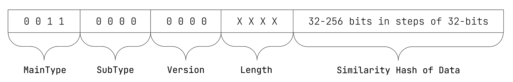

# ISCC-UNIT Data-Code

| IEP:      | 0008                                        |
|-----------|---------------------------------------------|
| Title:    | ISCC-UNIT Data-Code                         |
| Author:   | Titusz Pan <tp@iscc.foundation>             |
| Comments: | https://github.com/iscc/iscc-ieps/issues/13 |
| Status:   | DRAFT                                       |
| Type:     | Core                                        |
| License:  | CC-BY-4.0                                   |
| Created:  | {{ git_creation_date_localized }}           |
| Updated:  | {{ git_revision_date_localized }}           |

!!! note

    This document is a **DRAFT** contributed as input to 
    [ISO TC 46/SC 9/WG 18](https://www.iso.org/committee/48836.html). The final version is 
    developed at the International Organization for Standardization as
    [ISO/DIS 24138](https://www.iso.org/standard/77899.html)

## General

1. The Data-Code shall be a similarity hash for any kind of data regardless of its media type.
2. The Data-Code shall cluster digital assets that have near-identical data.
3. Small differences (as a proportion of the whole) in referent data shall yield identical Data-Codes.
4. More significant differences in referent data shall produce similar Data-Codes that can be compared against each other to estimate the data-similarity of the referents.
5. The Data-Code shall be resistant to data shifting and reordering sequences of data within referent data.

!!! note "NOTE"

    Changes of the Data-Code do not reflect semantic or syntactic changes of the content.

## Format

The Data-Code shall have the data format illustrated in Figure 10:

<figure markdown>
  
  <figcaption>Figure 10 - Data format of the Data-Code</figcaption>
</figure>

!!! example "EXAMPLE 1: 64-bit Data-Code in its canonical form:"

    ISCC:GAAWAIBQLNWP7X32

!!! example "EXAMPLE 2: 256-bit Data-Code in its canonical form:"

    ISCC:GADWAIBQLNWP7X32J3INMAMDUJ4QMN67BBQKVTVZIWHXQ7QJIKHYTBY

## Inputs

The input for calculating the Data-Code shall be the bytes of a file, without reference to their 
meaning or structure.

## Outputs

Data-Code processing shall generate the following output elements:

- iscc: the Data-Code in its canonical form (required).

## Processing

An ISCC processor shall calculate the Data-Code as follows:

1. Split the data into variable sized chunks with an average chunk size of 1024 bytes using the content defined chunking (CDC) algorithm.
2. Calculate the 32-bit integer hash of each chunk using the XXH32 algorithm.
3. Apply the minhash algorithm to the array of 32-bit integers to calculate the ISCC-BODY of the Data-Code with appropriate length.

!!! note "NOTE"

    For further technical details see source-code in modules 
    [code_data.py](https://github.com/iscc/iscc-core/blob/main/iscc_core/code_data.py)
    and [minhash.py](https://github.com/iscc/iscc-core/blob/main/iscc_core/minhash.py) of the 
    [reference implementation](https://github.com/iscc/iscc-core).

## Conformance

An implementation of the Data-Code algorithm shall be regarded as conforming to the standard if it 
creates the same Data-Code as the reference implementation for the same data input.

!!! note "NOTE"

    The ISCC reference implementation uses the open source XXHASH library [^1] for XXH32 chunk 
    hashing and appropriate use of this software will generate the same codes as the 
    reference implementation.

## Bibliography

[^1]: Collet, Yann. *xxHash: Extremely fast hash algorithm.*  
Accessed July 2022, available at https://cyan4973.github.io/xxHash/

