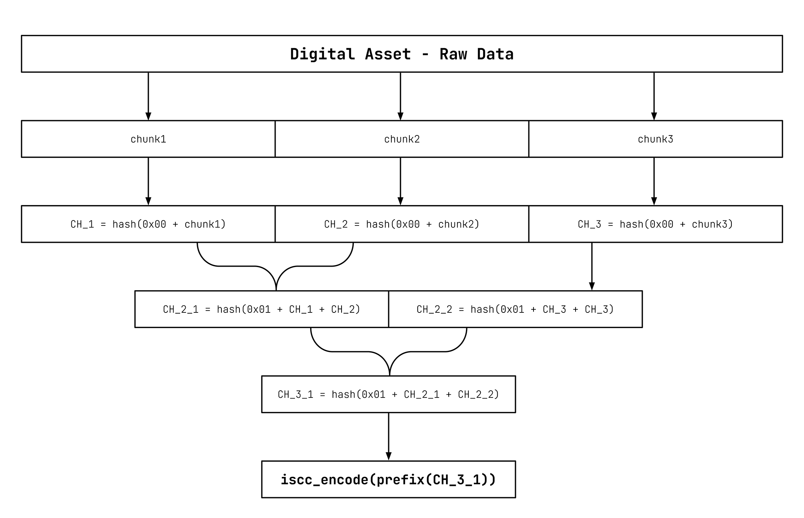
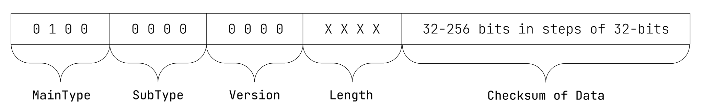

# ISCC-UNIT Instance-Code

| IEP:      | 0009                                        |
|-----------|---------------------------------------------|
| Title:    | ISCC-UNIT Instance-Code                     |
| Author:   | Titusz Pan <tp@iscc.foundation>             |
| Comments: | https://github.com/iscc/iscc-ieps/issues/14 |
| Status:   | DRAFT                                       |
| Type:     | Core                                        |
| License:  | CC-BY-4.0                                   |
| Created:  | {{ git_creation_date_localized }}           |
| Updated:  | {{ git_revision_date_localized }}           |

!!! note

    This document is a **DRAFT** contributed as input to 
    [ISO TC 46/SC 9/WG 18](https://www.iso.org/committee/48836.html). The final version is 
    developed at the International Organization for Standardization as
    [ISO/DIS 24138](https://www.iso.org/standard/77899.html)

## General

1. The Instance-Code shall be a checksum for any kind of data regardless of its media type.
2. The Instance-Code shall match identical files and indicate data transmission errors or data manipulation.
3. The Instance-Code shall be the prefix of a merkle root of a merkle tree as illustrated in [Figure 11](#fig-merkle-tree).
4. The cryptographic hash algorithm used for Instance-Code calculation shall be updated if a security weakness is discovered.
5. An update shall be indicated by a higher version number of the Instance-Code header.

<figure markdown id="fig-merkle-tree">
  
  <figcaption>Figure 11 - Example of a merkle tree</figcaption>
</figure>

!!! note "NOTE 1"

    Depending on security and uniqueness requirements, applications can generate and store 
    Instance-Codes up to a length of 256 bits in steps of 32 bits. Longer variants of an 
    Instance-Code are extensions of the shorter versions (which function only as checksums) and 
    remain compatible while improving the security of the hash.

!!! note "NOTE 2"

    The use of tree-based hashing supports efficient containment-proofs, verified streaming and 
    verification of data from trusted and untrusted sources. A data delivery application can 
    provide cryptographic proofs for partial data and streams such that the receiving application 
    can incrementally verify chunks of data against a given Instance-Code.

## Format

The Instance-Code shall have the data format illustrated in Figure 12.

<figure markdown>
  
  <figcaption>Figure 12 - Data format of the Instance-Code</figcaption>
</figure>

!!! example "EXAMPLE 1: 64-bit Instance-Code in its canonical form:"

    ISCC:IAAZ3NGA3HTIYUQD

!!! example "EXAMPLE 2: 256-bit Instance-Code in its canonical form:"

    ISCC:IADZ3NGA3HTIYUQD3SGC737FF6S5KRTRXY5DEU7ANCEMVTT4MDS2OQY

## Inputs

The input for calculating the Instance-Code shall be the bytes of a file, without reference to 
their meaning or structure.

## Outputs

Instance-Code processing shall generate the following output elements:

1. `iscc`: the Instance-Code in its canonical form (required);
2. `datahash`: a cryptographic hash of the input file encoded as multihash (optional);
3. `filesize`: the size of the input file in bytes (optional).

## Processing

An ISCC processor shall calculate the Instance-Code as follows:

1. Apply the tree-based cryptographic hash function to the file input using the appropriate number of bytes for the output digest.
2. Use the hash digest of output as the ISCC-BODY of the Instance-Code.

For further technical details see source-code in modules 
[code_instance.py](https://github.com/iscc/iscc-core/blob/main/iscc_core/code_instance.py) of the 
[reference implementation](https://github.com/iscc/iscc-core).

!!! note "NOTE"

    The merkle tree chunk size is defined by the BLAKE3 [^1] algorithm to be 1024 bytes.

## Conformance

An implementation of the Instance-Code algorithm shall be regarded as conforming to the standard 
if it creates the same Instance-Code as the reference implementation for the same data input.

!!! note "NOTE"

    The ISCC reference implementation uses the open source BLAKE3 [^1] library for merkle tree 
    hashing and appropriate use of this software will generate the same codes as the reference 
    implementation.

## Bibliography

[^1]: O’Connor, J., Aumasson, J.P., Neves, S., Wilcox-O’Hearn, Z., *BLAKE3: one function, fast everywhere.* 
Version 20211102173700, accessed July 2022. 
Available at https://github.com/BLAKE3-team/BLAKE3-specs/blob/master/blake3.pdf

