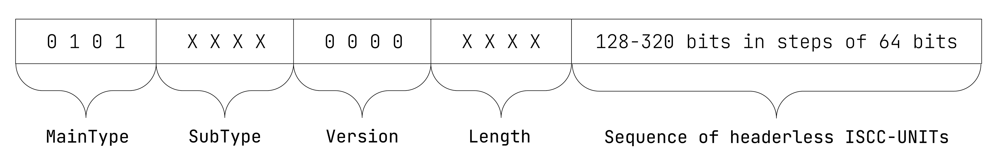
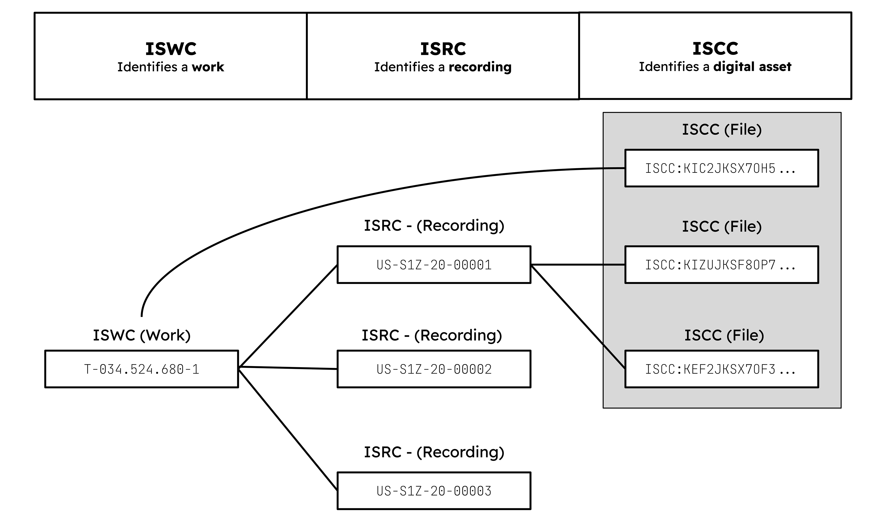

# ISCC-CODE

| IEP:      | 0010                                        |
|-----------|---------------------------------------------|
| Title:    | ISCC-CODE                                   |
| Author:   | Titusz Pan <tp@iscc.foundation>             |
| Comments: | https://github.com/iscc/iscc-ieps/issues/15 |
| Status:   | DRAFT                                       |
| Type:     | Core                                        |
| License:  | CC-BY-4.0                                   |
| Created:  | {{ git_creation_date_localized }}           |
| Updated:  | {{ git_revision_date_localized }}           |

!!! note

    This document is a **DRAFT** contributed as input to 
    [ISO TC 46/SC 9/WG 18](https://www.iso.org/committee/48836.html). The final version is 
    developed at the International Organization for Standardization as
    [ISO/DIS 24138](https://www.iso.org/standard/77899.html)

## General

An ISCC-CODE shall be an ordered sequence of two or more headerless ISCC-UNITs of different 
MainTypes derived from one referent prefixed with a common header.

## Purpose

The ISCC-CODE shall support identification, clustering, discovery and matching of files based on 
their metadata, content, data similarity, and where appropriate it shall be used together with 
other identifiers in accordance with the principles outlined in the [Annex](#8-annex).

## Format

The ISCC-CODE shall have the data format illustrated in Figure 13:

<figure markdown>
  
  <figcaption>Figure 13 - Data format of the ISCC-CODE</figcaption>
</figure>

!!! example "EXAMPLE 1: 128-bit ISCC-CODE with Data-Code and Instance-Code:"

    ISCC:KUAIFYXGML3SRNH25MIWPM3HVHBXQ

!!! example "EXAMPLE 2: 256-bit ISCC-CODE with Meta-, Text-, Data-, and Instance-Code:"

    ISCC:KAC6HZYGQLBASTFMBJOS6NDLVKKFLAXC4ZRPOKFU7LVRCZ5TM6U4G6A

### SubTypes

1. If an ISCC-UNIT of type CONTENT is sequenced into an ISCC-CODE, the SubType of the ISCC-CODE shall be that of the Content-Code (see 4.2.2 SubTypes).
2. If the ISCC-CODE is composed only of a sequence of the types META, DATA, and INSTANCE, the SubType shall be NONE.
3. If the ISCC-CODE is composed only of a sequence of types DATA and INSTANCE, the SubType shall be SUM.

### Length

1. The length in bits of the ISCC–BODY of an ISCC-CODE shall be calculated as the number of data bits set in the Length field of the header times 64 plus 128 bits.
2. The ISCC-UNITs composed into an ISCC-CODE shall be ordered as follows: META, SEMANTIC, CONTENT, DATA, INSTANCE.
3. The data bits of the Length field shall be the bits following the prefix bit(s) and they shall encode the composition of the ISCC-BODY of an ISCC-CODE as follows:
    1. The first data bit shall signify the presence of a Meta-Code.
    2. The second data bit shall signify the presence of a Semantic-Code.
    3. The third data bit shall signify the presence of a Content-Code.

## Inputs

1. The input for calculating an ISCC-CODE shall be a collection of ISCC-UNITs.
2. The input shall include at least a Data-Code and an Instance-Code with a minimum of 64 bits each.
3. The input shall include at most one ISCC-UNIT of each MainType.
4. If both a Semantic-Code and a Content-Code are given as input, they shall be of the same SubType.

## Outputs

ISCC-CODE processing shall generate the following output elements:

1. `iscc`: the ISCC-CODE in its canonical form (required);
2. `filename`: the name of the input file (optional);
3. any other elements collected during processing of the individual ISCC-UNITs (optional).

## Processing

An ISCC processor shall compose an ISCC-CODE as follows:

1. Sort the ISCC-UNITs according to their predefined order (META, SEMANTIC, CONTENT, DATA, INSTANCE).
2. Decode the ISCC-UNITs to binary and if supplied SubTypes of the Semantic-Code and Content-Code are different, halt.
3. Remove the headers of the decoded ISCC-UNITs.
4. Truncate the ISCC-UNITs by keeping only the first 64 bits.
5. Concatenate the headerless and truncated ISCC-UNITs in sorted order to construct the final ISCC-BODY of the ISCC-CODE.
6. Prefix the ISCC-BODY with the appropriate ISCC-HEADER and encode the result to its canonical form.

For further details see source-code in the module 
[iscc_code.py](https://github.com/iscc/iscc-core/blob/main/iscc_core/iscc_code.py) of the 
[reference implementation](https://github.com/iscc/iscc-core).

## Comparing

To measure the similarity of two ISCC-CODEs, check if the Instance-Codes are identical. Calculate 
the binary hamming distance of the ISCC-BODYs of the other ISCC-UNITs with the same MainType and 
SubType. Lower values of the hamming distance indicate higher probability of similarity. Higher 
values of the hamming distance indicate decreasing similarity. The threshold indicating identity 
will vary according to the MainType and the application.

For further details, see source-code of the function `iscc_compare` in the module 
[utils.py](https://github.com/iscc/iscc-core/blob/main/iscc_core/utils.py) of the
[reference implementation](https://github.com/iscc/iscc-core).

## Annex

### Principles

An ISCC-CODE shall be used for the identification of digital assets. It shall, where appropriate, 
be used in conjunction with existing identifier schemes (see Figure A.1).

An ISCC-CODE shall not be used as a replacement for other identifier schemes such as DOI, ISAN, 
ISBN, ISRC, ISSN, ISWC, and other commonly recognized identifiers.

<figure markdown>
  
  <figcaption>Figure A.1 - Example of the use of ISCC in relation to ISWC and ISRC</figcaption>
</figure>

### Linking

If the referent of an ISCC is the manifestation of another entity that has an identifier within 
another identifier scheme, the relationship shall be indicated in the ISCC metadata element 
`identifier` (see [IEP-0012](iep-0012.md)).

!!! note "NOTE"

The `dentifier` element used in the ISCC metadata schema can reference multiple identifiers.

### Use of ISCC

Other identifier schemes that wish to integrate with ISCC shall:

1. specify a metadata schema to be used as seed metadata for generating ISCCs in the context of their use cases;
2. add ISCCs to their metadata in order to link their referents to related digital manifestations.

Seed metadata schema shall:

1. define the descriptive elements to be used for matching referents based on similar metadata;
2. use ISO/IEC 21778:2017 JSON format;
3. use JSON-LD syntax;
4. be defined by a JSON schema;
5. be registered as an IANA media type.

If possible, seed metadata shall be embedded into a digital asset as described in
[IEP-0002 - Metadata embedding](iep-0002.md#7-metadata-embedding) 

