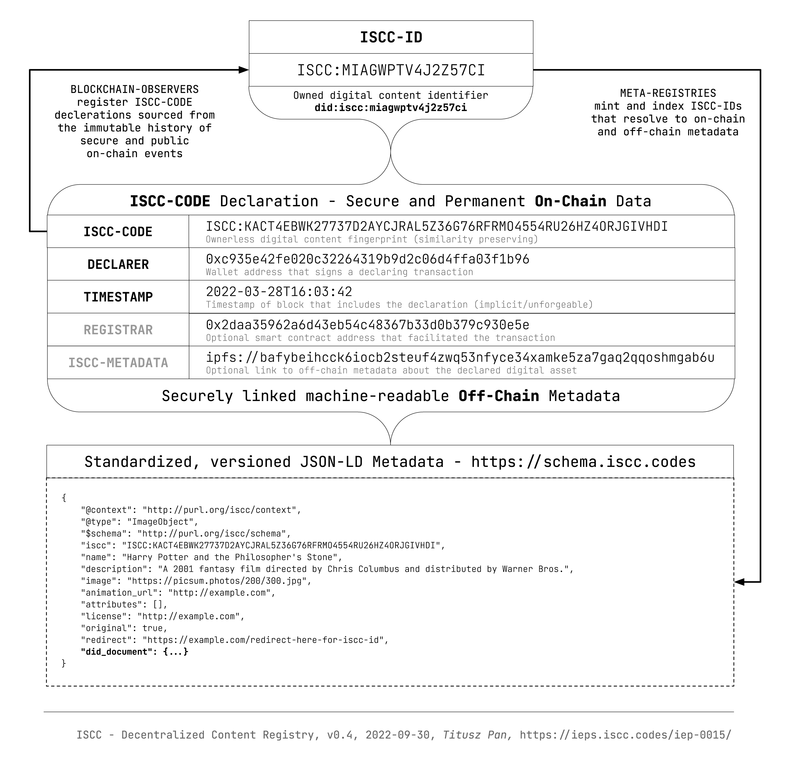
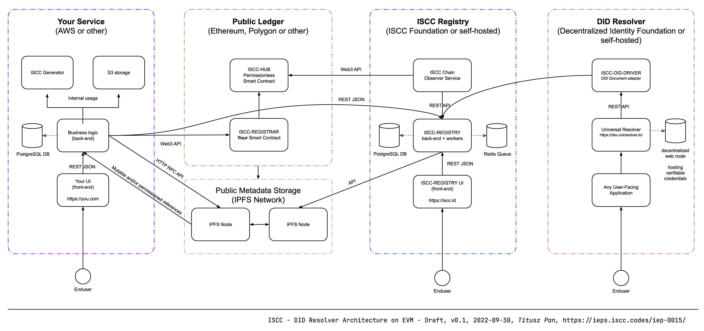

# ISCC DID Method

| IEP:      | 0015                                        |
|-----------|---------------------------------------------|
| Title:    | ISCC DID Method                             |
| Author:   | Titusz Pan <tp@iscc.foundation>             |
| Comments: | https://github.com/iscc/iscc-ieps/issues/20 |
| Status:   | DRAFT                                       |
| Type:     | Core                                        |
| License:  | CC-BY-4.0                                   |
| Created:  | {{ git_creation_date_localized }}           |
| Updated:  | {{ git_revision_date_localized }}           |


## Status of This Document

This document is a draft of a potential specification. It has no official standing of any kind and
does not represent the support or consensus of any standards organization.

## Introduction

### Motivation

The need for a universal identifier for digital content has emerged as an increasing amount of
dynamic, short-lived and granular digital content is produced, consumed and processed. Commercial
interests of many stakeholders depend on proper identification of digital content.

Professionally produced digital content but also semi-professional and user-generated content are
the currency of the information age. A variety of specific content identifier standards already 
exist, but a universal content-dependent identifier for digital media has not yet been developed.

In particular, the structure and management of identifiers for digital content have a substantial
impact on the level of possible adoption, automation, and the potential for machine-to-machine 
communication and innovation within and across different industry sectors.

Digital content is dynamic, always in motion, and acted upon globally by a variety of entities with 
different interests and requirements. Digital content continuously re-encodes, resizes, and 
re-compresses, changing its underlying data as it travels through a complex network of actors and 
systems. These circumstances require a special design for a universal identifier that is capable
of searching and matching transcoded or otherwise similar content on a global scale.

### The ISCC 

The ISCC (International Standard Content Code) is a universal and open identification system for
text, audio, image, and video based content. ISCC-CODEs can be created from media assets by anybody
using open source software. Similar content can then be matched by comparing ISCC-CODEs only.

!!! example "Example ISCC-CODE"
    ```
    ISCC:KECYCPU3OKIUDZ7TYBRK5HZ4JGPTILLAT2IW7TY7EYIJI4QSK5I353I
    Decoded: ISCC-IMAGE-V0-MCDI-813e9b729141e7f3c062ae9f3c499f342d609e916fcf1f26109472125751beed
    ```

Users can also register ISCC-CODEs on any supported public blockchain to obtain a short and globaly
unique ISCC-ID. The ISCC-ID is under the control of the registrant and resolves to an ISCC-CODE, 
on-chain metadata and optional off-chain metadata. ISCC-IDs are globaly unique even if the same
ISCC-CODE is registered multiple times by different entities. An ISCC-ID is minted 
deterministically by observing participating legers and can be reproduced by anybody who observes 
the public and immutable registration events.

!!! example "Example ISCC-ID"
    ```
    ISCC:MIAGWPTV4J2Z57CI
    Decoded: ID-ETHEREUM-V0-64-6b3e75e2759efc48
    ```

### ISCC as DID

The ISCC DID method creates a mechanism to reference digital content with a globaly unique
persistent identifier that does not require a centralized registration authority. Instead, the
ISCC system defines an open and voluntary cross-chain registration protocol using cryptography and
distributed ledger technology.

Integrating ISCC with the DID system improves ISCC interoperability. DID documents provide
standardized ways to discover [services](https://www.w3.org/TR/did-core/#services) related to the
referenced content and its registrant.

[Verifiable credentials](https://www.w3.org/TR/vc-data-model/) discovered through the DID document 
`service` property can improve trust in otherwise permissionless content registrations. Additionaly
the use of [decentralized web nodes](https://identity.foundation/decentralized-web-node/spec/) allow
for interoperable discovery and data sovereignity of hosted verifiable credentials.

At the same time ISCC would bring open content identification to the *Decentalized Identifiers* 
ecosystem.

## Method Syntax

### Method Name

1. The name that shall identify this DID method is: `iscc`.
2. A DID that uses this method MUST begin with the following prefix: `did:iscc:`.
3. According to the DID specification, this string MUST be in lowercase.

### Method Specific Identifier

The ISCC DID scheme conforms to the [DID Syntax](https://w3c.github.io/did-core/#did-syntax) and is
defined by the follwing [ABNF](https://www.rfc-editor.org/info/std68):

!!! example "ISCC DID scheme ABNF"

    ```abnf
    iscc-did = "did:iscc:" iscc
    iscc     = 10*88(numbers / letters)
    numbers  = %x32-37  ; 2-7
    letters  = %x61-7A  ; a-z
    ```

1. The data structure of the ISCC is `<MainType><SubType><Version><Length><ISCC-BODY>`
2. The method specific identifier is a lower-cased base32 representation of the [ISCC structure](/iep-0001).
3. The regular expression for this DID method is `^did:iscc:[2-7a-z]{10,88}$`

### ISCC DID Example

!!! example "DID representation of an ISCC-ID"
    ```
    did:iscc:miagwptv4j2z57ci
    ```

## Method Operations

1. All operations are authorized by signed transactions of the controller.
2. An ISCC-DID is created by publicly declaring an ISCC-CODE in accordance with the [cross-chain declaration protocol](/iep-0013).
3. The initial controller of the DID document is the [did:pkh](https://github.com/w3c-ccg/did-pkh/blob/main/did-pkh-method-draft.md) representation of the blockchain account that signed the declaration transaction.
4. A basic DID document is automatically and deterministicaly derived from on-chain metadata.
5. The controller MAY set a custom DID Document by embedding or referencing it from [ISCC Metadata](https://schema.iscc.codes)
6. The DID Document MAY be updated or deactivated in accordence with the chain specific implementation of the declaration protocol.

## Verifiable Data Registry

The [verifiable data registry](https://www.w3.org/TR/did-core/#architecture-overview) for ISCC 
declarations is a federation of existing public ledgers that support the declaration protocol. The 
protocol can be implemented on most public ledgers (even without smart contracts) that provide an 
orderd, immutable, append-only history of signed transactions. 

<figure markdown>
  
  <figcaption>Figure 1 - ISCC Verifiable Data Registry</figcaption>
</figure>

## DID Document

DID documents are sourced from on-chain metadata and optionally from immutably or mutably
referenced off-chain metadata. 

All information required to construct a basic valid DID document from an ISCC declaration is
available on-chain and can be dynamically transformed and presented as DID document by a DID 
driver implementation.

!!! example "Minimal ISCC DID Document example"

    ```json
    {
      "@context": [
        "https://www.w3.org/ns/did/v1",
        {
          "EcdsaSecp256k1RecoveryMethod2020": "https://identity.foundation/EcdsaSecp256k1RecoverySignature2020#EcdsaSecp256k1RecoveryMethod2020",
          "blockchainAccountId": "https://w3id.org/security#blockchainAccountId"
        }
      ],
      "id": "did:iscc:miagwptv4j2z57ci",
      "alsoKnownAs": "iscc:kecycpu3okiudz7tybrk5hz4jgptillat2iw7ty7eyiji4qsk5i353i",
      "verificationMethod": [
        {
          "id": "did:pkh:eip155:1:0x901ee44e3bddf4bc1c08a2ed229498512f8bcfdc#blockchainAccountId",
          "type": "EcdsaSecp256k1RecoveryMethod2020",
          "controller": "did:pkh:eip155:1:0x901ee44e3bddf4bc1c08a2ed229498512f8bcfdc",
          "blockchainAccountId": "eip155:1:0x901ee44e3bddf4bc1c08a2ed229498512f8bcfdc"
        }
      ],
      "authentication": [
        "did:pkh:eip155:1:0x901ee44e3bddf4bc1c08a2ed229498512f8bcfdc#blockchainAccountId"
      ],
      "assertionMethod": [
        "did:pkh:eip155:1:0x901ee44e3bddf4bc1c08a2ed229498512f8bcfdc#blockchainAccountId"
      ]
    }
    ```

Additional/Optional DID document data MAY be added off-chain in mutable or immutable modes and
retrived and incjected by the DID driver in realtime to compose an extended DID document that
includes other properties.

## Resolving DIDs

1. An ISCC DID can be resolved by querying an instantiation of an [ISCC content registry](https://github.com/iscc/iscc-registry).
2. The authenticity of the response can be verified through the referenced on-chain transaction.

<figure markdown>
  
  <figcaption>Figure 2 - ISCC DID Architecture</figcaption>
</figure>

## Security & Privacy Consideration

Implementers should be aware that ISCC-CODEs are not cryptographic hashes but descriptors or 
similarity preserving (soft) hashes. As such they leak information about the structure of the
identified content. This is by design and necessary to support similarity matching with ISCC-CODEs.

An ISCC DID document need not contain a proof property. All operations are authenticated with the 
signature of the transaction payload sent to the network of the originating ledger. 
This signature is generated using a key specified in the corresponding DID Document.

## Reference Implementation

An end-to-end reference implementation of the decentralized content registry is manifested by the
following modules:

- Codec and Algorithms: https://github.com/iscc/iscc-core
- ISCC Metadata: https://github.com/iscc/iscc-schema
- EVM Smart Contracts: https://github.com/iscc/iscc-evm
- EVM Chain Observer: https://github.com/iscc/iscc-observer-evm
- ISCC Content Registry: https://github.com/iscc/iscc-registry
- Public Instantiation: https://iscc.id

