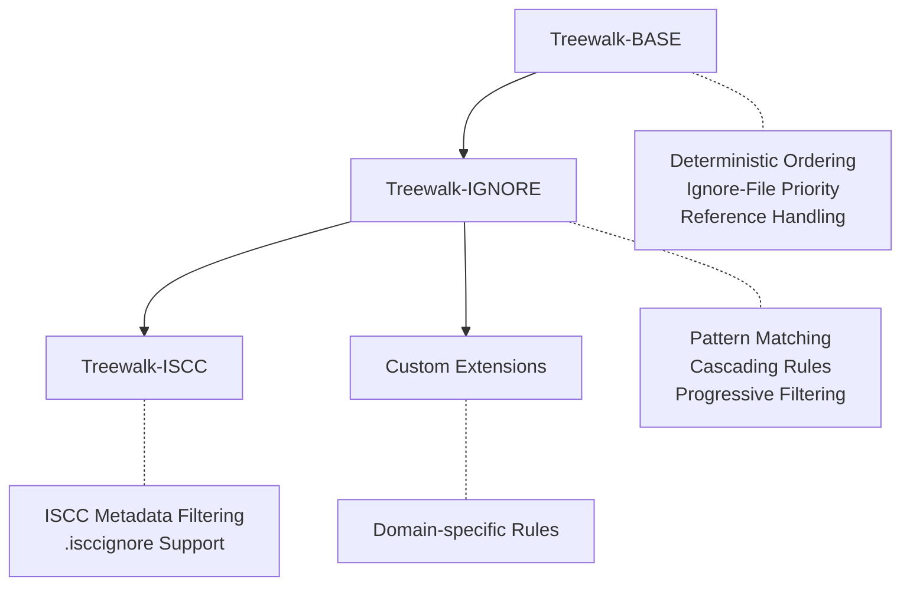

# Treewalk - Deterministic Tree Traversal

| IEP:      | 0017                                        |
| --------- | ------------------------------------------- |
| Title:    | Treewalk - Deterministic Tree Traversal     |
| Author:   | Titusz Pan <tp@iscc.io>                     |
| Comments: | https://github.com/iscc/iscc-ieps/issues/22 |
| Status:   | Draft                                       |
| Type:     | Core                                        |
| Standard: | IEP                                         |
| License:  | CC-BY-4.0                                   |
| Created:  | {{ git_creation_date_localized }}           |
| Updated:  | {{ git_revision_date_localized }}           |

!!! note

    This document is a **DRAFT** intended as input to
    [ISO TC 46/SC 9/WG 18](https://www.iso.org/committee/48836.html) for a future revision of ISO 24138.

## Abstract

This specification defines a layered approach to deterministic tree traversal, consisting of a core
algorithm and two standard extensions. The Treewalk-BASE algorithm provides consistent ordering for
hierarchical storage structures. The Treewalk-IGNORE extension adds gitignore-style pattern
filtering, while Treewalk-ISCC provides domain-specific filtering for ISCC metadata. Each layer
builds upon the previous, ensuring consistent cross-platform ordering while enabling progressive
filtering capabilities. The specification applies to file systems, archive formats (ZIP, EPUB,
DOCX), cloud storage (S3, Azure Blob), and any system with directory-like organization.

______________________________________________________________________

## Introduction

### Motivation

Content-based identifiers and integrity verification systems require deterministic file ordering to
produce consistent results across different environments. Traditional directory traversal methods
yield entries in file system-dependent order, making reproducible hashing impossible. This
specification solves that problem through a layered approach that separates core traversal logic
from filtering concerns.

### Scope

This specification defines three algorithms:

**Treewalk-BASE**:

- Deterministic ordering of hierarchical entries
- Ignore file prioritization for early filtering opportunities
- Security considerations for reference handling

**Treewalk-IGNORE Extension**:

- Gitignore-style pattern matching
- Cascading ignore rules from root to leaf directories
- Pattern accumulation and inheritance

**Treewalk-ISCC Extension**:

- ISCC-specific pattern matching and filtering
- Built on top of Treewalk-IGNORE functionality
- Domain-specific file exclusions

This specification does NOT cover:

- Content reading or hashing algorithms
- Storage-specific authentication or access control
- Entry metadata beyond names and types
- Implementation details for specific storage systems

______________________________________________________________________

## Terminology

**Entry** : A named object within a hierarchical storage system (file, directory, archive member, S3
object).

**Container** : An entry that can contain other entries (directory, folder, ZIP archive, S3 prefix).

**Yield/Output** : When an entry is "yielded" or appears in the "output", it means the entry path is
returned to the caller. Containers are traversed but not yielded — only files within containers
appear in output.

**NFC Normalization** : Unicode Normalization Form C - a canonical form ensuring consistent
representation of equivalent Unicode sequences.

**Ignore File** : An entry whose name starts with "." and ends with "ignore" (e.g., .gitignore,
.isccignore) containing patterns for entries to exclude.

**Reference** : A storage-specific link to another entry (symbolic link, archive member reference,
S3 redirect).

______________________________________________________________________

## Architecture Overview

The Treewalk specification defines a layered architecture where each extension builds upon the
previous:



Each layer maintains the core guarantees while adding specific functionality:

- **Treewalk-BASE**: Provides deterministic ordering across all platforms
- **Treewalk-IGNORE**: Adds configurable filtering with pattern inheritance
- **Treewalk-ISCC**: Implements ISCC-specific requirements
- **Custom Extensions**: Enable domain-specific adaptations

______________________________________________________________________

## Core Algorithm Specification

### Entry Ordering

An implementation shall sort directory entries as follows:

1. Apply Unicode NFC normalization to each entry name.
2. Encode the normalized name as UTF-8.
3. Sort entries by comparing the resulting byte sequences lexicographically.

When multiple entries have identical names after NFC normalization, the implementation shall yield
all such entries sorted by lexicographically comparing their original, pre-normalization UTF-8
encoded byte sequences as a tie-breaker. This ensures deterministic output even when storage systems
allow multiple entries with equivalent names.

!!! note

    Some storage systems (e.g., case-insensitive filesystems) may prevent creation of entries with
    names that differ only in case or normalization. In such cases, only the accessible entry will be
    yielded.

#### Example

Given entries: ["café", "caffe", "Café"]

After NFC normalization and UTF-8 encoding, the sorted order is:

- "Café" (capital C sorts before lowercase)
- "café"
- "caffe"

#### Deterministic Duplicate Handling

When entries have identical normalized names, all of them are yielded in a deterministic order based
on their original byte sequences to ensure consistent output across implementations. This approach:

- **Preserves information**: No entries are silently dropped
- **Maintains determinism**: The same storage state always produces the same output
- **Respects storage capabilities**: Systems that prevent duplicates naturally have none to yield
- **Enables verification**: Consumers can detect and handle duplicates as needed

### Treewalk-BASE Algorithm

An implementation shall yield entries in depth-first order as follows:

1. For each container in the traversal, process entries in three phases:
    1. Yield files matching pattern `.*ignore` (e.g., .gitignore, .npmignore) in sorted order.
    2. Yield all other files in sorted order.
    3. Recurse into subdirectories in sorted order.
2. Containers (directories) themselves shall not appear in the output.
3. Only files within containers shall be yielded.

!!! note

    This ordering ensures ignore files are discovered and yielded before the regular files they
    might filter, enabling extensions to process filtering rules early.

The base algorithm itself shall not process ignore file contents or apply filtering. It only ensures
deterministic ordering with ignore file prioritization.

If an entry cannot be read or accessed during traversal, the implementation shall skip the entry and
may report a warning.

### Reference Handling

The implementation shall not follow references (symbolic links, redirects) when:

1. Determining if an entry is a regular entry or container.
2. Recursing into sub-containers.

References shall not appear in traversal output.

______________________________________________________________________

## Treewalk-IGNORE Extension

### Overview

The **Treewalk-IGNORE** extension adds gitignore-style pattern filtering to the base algorithm. It
maintains the same deterministic ordering while progressively filtering entries based on accumulated
patterns.

### Pattern Processing

An implementation using Treewalk-IGNORE shall process patterns as follows:

1. Accept specification of which ignore file to process (e.g., `.gitignore` or `.npmignore`).
2. Check for the specified ignore file in each directory.
3. Parse patterns using gitignore-style syntax.
4. Accumulate patterns from root to current directory.
5. Apply patterns to filter files and control directory traversal.

#### Directory Filtering

Since directories are not yielded as output entries, directory patterns control traversal. An
implementation shall apply directory filtering as follows:

1. If a directory matches an ignore pattern, the implementation shall not recurse into it.
2. This prevents all files within that directory from appearing in the output.
3. Directory patterns shall be checked with a trailing "/" to ensure proper matching.

!!! note

    A pattern like `temp/` prevents traversal into any directory named "temp", effectively
    excluding all files within it from the output.

#### Pattern Matching Rules

An implementation shall apply the following pattern matching rules:

1. Pattern matching shall be case-sensitive.
2. Only one ignore file type shall be processed per traversal.
3. Later patterns shall have higher precedence than earlier patterns within the same file.
4. Child directory patterns shall have higher precedence than parent directory patterns.
5. Patterns from child directories shall override patterns from parent directories.

### Example with .gitignore

```
repo/
├── .gitignore (contains: *.log, temp/)
├── src/
│   ├── main.py
│   └── debug.log
└── temp/
    └── cache.dat

Yields only:
- repo/.gitignore
- repo/src/main.py
```

!!! note

    The ignore file itself is included in the output (unless excluded by a parent ignore file).

______________________________________________________________________

## Treewalk-ISCC Extension

### Overview

The **Treewalk-ISCC** extension provides ISCC-specific filtering on top of Treewalk-IGNORE. It
automatically filters metadata files while respecting `.isccignore` patterns.

### Automatic Exclusions

An implementation using Treewalk-ISCC shall exclude:

1. Files ending with `.iscc.json` (ISCC metadata files).
2. Any patterns specified in `.isccignore` files.

### Implementation

An implementation shall apply Treewalk-ISCC as follows:

1. Apply Treewalk-IGNORE with `.isccignore` as the ignore file name.
2. Additionally filter out files ending with `.iscc.json`.

This layered approach ensures consistent behavior while adding domain-specific rules.

!!! note

    The automatic exclusion of `.iscc.json` files cannot be overridden by `.isccignore` patterns.
    These files are always excluded, even if `.isccignore` contains patterns that would otherwise
    include them.

______________________________________________________________________

## Implementation Guidance

### Storage System Adaptation

#### File Systems

- Use native directory listing APIs (e.g., `os.scandir()`)
- Filter symbolic links during initial scan
- Resolve paths to absolute form before traversal
- On Windows, handle drive roots (e.g., `C:\`) as valid starting points

#### Archive Formats (ZIP, EPUB, DOCX)

- Treat archive members as entries
- Use "/" as universal path separator
- Process nested archives as sub-containers
- Apply the same NFC normalization to member names

#### Cloud Storage (S3, Azure Blob)

- Use prefix-based queries for "directory" listing
- Treat key prefixes ending with "/" as containers
- Batch API calls for efficiency
- Skip zero-byte objects with keys ending in "/" (S3 directory markers)

### Path Representation

An implementation shall represent paths as follows:

1. Use forward slash (/) as universal path separator.
2. Calculate relative paths from traversal root.
3. Apply NFC normalization before any path operations.

### Security Considerations

An implementation shall apply the following security measures:

1. Validate that all paths remain within the traversal root.
2. Not follow references to prevent traversal attacks.

An implementation should apply the following additional security measures:

1. Implement depth limits for deeply nested structures (e.g., 256 levels).
2. Enforce size limits when processing archives (e.g., 4 GiB per archive).

______________________________________________________________________

## Extensibility

### Custom Extensions

Implementations may create additional extensions following the layered pattern:

1. Build on top of existing layers (Base → Ignore → Domain-specific).
2. Maintain deterministic ordering guarantees.
3. Document extension-specific behavior clearly.

### Custom Ignore Files

Treewalk-IGNORE implementations may support different ignore file names by allowing the caller to
specify which ignore file to process:

1. `.gitignore` — Git-style ignores
2. `.npmignore` — NPM-style ignores
3. `.isccignore` — ISCC-specific ignores
4. `.customignore` — Domain-specific ignores

!!! note

    Each traversal processes only one type of ignore file as specified by the implementation or
    caller.

!!! warning "Git Compatibility"

    Git implicitly excludes `.git/` directories from all operations, even when not specified in
    `.gitignore`. Treewalk-IGNORE processes all directories unless explicitly ignored. To replicate
    Git's behavior when using `.isccignore` files, explicitly add `.git/` to your ignore patterns.
    This design keeps Treewalk generic and avoids hardcoding VCS-specific assumptions.

______________________________________________________________________

## Test Vectors

Implementations shall produce identical ordering for these test cases:

### Treewalk-BASE Tests

#### Test Case 1: Unicode Normalization

**Structure:**

```yaml
  - path: Café.txt       # NFC form (U+00E9)
  - path: Café.txt      # NFD form (U+0065 U+0301)
  - path: café.txt       # NFC form (U+00E9)
  - path: caffe.txt
```

**Expected (Treewalk-BASE):**

```yaml
  - test_dir/Café.txt      # NFD form (comes first due to byte ordering)
  - test_dir/Café.txt       # NFC form
  - test_dir/caffe.txt
  - test_dir/café.txt
```

!!! note

    On case-insensitive filesystems, only one of "Café.txt" or "café.txt" may be created,
    resulting in fewer entries in the output.

#### Test Case 2: Duplicate Normalized Names

**Structure:**

```yaml
# These normalize to the same NFC form
  - path: é.txt        # U+00E9 (precomposed)
  - path: é.txt       # U+0065 U+0301 (decomposed)
```

**Expected (Treewalk-BASE):**

```yaml
# Both entries yielded if storage allows both, preserving their original forms
  - test_dir/é.txt      # NFD form (comes first due to byte ordering)
  - test_dir/é.txt       # NFC form
```

!!! note

    Storage systems typically prevent creation of both forms, so usually only one entry will exist
    and be yielded. The key guarantee is that whatever entries exist will be yielded deterministically.

#### Test Case 3: Ignore File Priority

**Structure:**

```yaml
  - path: .gitignore
  - path: aaa.txt
  - path: zzz.txt
```

**Expected (Treewalk-BASE):**

```yaml
  - test_dir/.gitignore
  - test_dir/aaa.txt
  - test_dir/zzz.txt
```

### Treewalk-IGNORE Tests

#### Test Case 4: Pattern Filtering

**Structure:**

```yaml
  - path: .gitignore
    content: '*.log'
  - path: app.py
  - path: debug.log
  - path: error.log
```

**Expected (Treewalk-IGNORE with .gitignore):**

```yaml
  - test_dir/.gitignore
  - test_dir/app.py
```

### Treewalk-ISCC Tests

#### Test Case 5: ISCC Metadata Filtering

**Structure:**

```yaml
  - path: .isccignore
    content: temp/
  - path: data.txt
  - path: data.txt.iscc.json
  - path: temp
    type: dir
  - path: temp/cache.dat
```

**Expected (Treewalk-ISCC):**

```yaml
  - test_dir/.isccignore
  - test_dir/data.txt
```

!!! note

    The `temp/` pattern prevents traversal into the temp directory, so `temp/cache.dat` is
    excluded. The file `data.txt.iscc.json` is automatically filtered by the ISCC extension.

______________________________________________________________________

## References

### Normative

- Unicode Standard Annex #15: Unicode Normalization Forms
- RFC 3629: UTF-8, a transformation format of ISO 10646

### Informative

- gitignore(5) - Git ignore patterns specification
- ISO 24138:2024 - International Standard Content Code
- ZIP File Format Specification
- Amazon S3 API Reference
