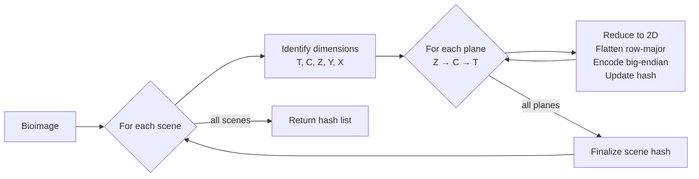

# Imagewalk - Deterministic Bioimage Traversal

| IEP:      | 0018                                         |
| --------- | -------------------------------------------- |
| Title:    | Imagewalk - Deterministic Bioimage Traversal |
| Author:   | Titusz Pan <tp@iscc.io>                      |
| Comments: | https://github.com/iscc/iscc-ieps/issues/27  |
| Status:   | Draft                                        |
| Type:     | Core                                         |
| Standard: | IEP                                          |
| License:  | CC-BY-4.0                                    |
| Created:  | {{ git_creation_date_localized }}            |
| Updated:  | {{ git_revision_date_localized }}            |

!!! note

    This document is a **DRAFT** intended as input to
    [ISO TC 46/SC 9/WG 18](https://www.iso.org/committee/48836.html) for a future revision of ISO 24138.

## Abstract

This specification defines a deterministic algorithm for traversing multi-dimensional bioimage data
and converting it to a canonical byte sequence. The algorithm ensures that identical pixel data
produces identical output regardless of source format (OME-TIFF, OME-Zarr, OMERO, CZI, and others)
or storage platform. It handles the common bioimage dimensions (T, C, Z, Y, X), supports multi-scene
files, and provides a format-agnostic foundation for content-based identification of bioimaging
data.

______________________________________________________________________

## Introduction

### Motivation

Bioimaging data exists in numerous formats with different internal storage layouts and dimension
orders. Format-specific hashing produces different results for semantically identical pixel data
stored in different formats. This specification solves that problem by defining a canonical
traversal and byte representation that is independent of storage format, enabling reproducible
content-based identifiers for bioimage data.

!!! note

    This specification is compatible with the internal pixel-data canonicalization used by the OMERO
    server (version 5.29.2) to generate hashes at the scene level.

### Scope

This specification defines:

- a deterministic plane traversal order for multi-dimensional bioimage data;
- a canonical byte representation for 2D pixel planes;
- the handling of the standard bioimage dimensions (T, C, Z, Y, X);
- the processing of multi-scene files.

This specification does not cover:

- file format parsing, decoding, or storage access;
- selection or implementation of a hash function;
- pixel value transformation, rescaling, or normalization;
- metadata extraction, validation, or processing;
- image compression or encoding methods.

______________________________________________________________________

## Terminology

**Bioimage** : A multi-dimensional pixel array representing microscopy or other bioimaging data.

**Scene** : An independent image within a file that may contain more than one image. Each scene has
its own dimensional structure and is processed independently. Some formats call this a series.

**Plane** : A 2D array of pixels with dimensions Y (height) and X (width) at a fixed combination of
Z, C, and T coordinates.

**Dimension** : An axis of the multi-dimensional pixel array. The standard bioimage dimensions are:

- **T** (Time): the temporal dimension for time-series data;
- **C** (Channel): the spectral or fluorescence channel dimension representing a single imaging
    modality (for example GFP, DAPI, or brightfield);
- **Z** (Depth): the Z-stack or focal-plane dimension;
- **Y** (Height): the vertical spatial dimension;
- **X** (Width): the horizontal spatial dimension.

**Canonical bytes** : The standardized byte representation of a pixel plane that yields
deterministic, cross-platform reproducible output.

**Row-major order** : The linear ordering in which the rightmost index varies fastest (C-order). For
a 2D plane (Y, X) the pixels are ordered row 0 (all X), row 1 (all X), and so on.

**Big-endian** : The byte order in which the most significant byte appears first (network byte
order).

______________________________________________________________________

## Algorithm Overview



The algorithm processes a bioimage deterministically by:

1. processing each scene independently;
2. traversing the planes of each scene in Z→C→T order;
3. converting each plane to canonical bytes;
4. producing one hash per scene.

______________________________________________________________________

## Core Algorithm Specification

### Scene Processing

For a file that contains more than one scene, an implementation shall:

1. process each scene independently, initializing a separate hash for each scene;
2. process scenes in ascending scene index order (0, 1, 2, …);
3. produce one hash per scene;
4. return the hashes as an ordered list in scene index order.

A single-scene file yields a single-element list. A file with no accessible scenes yields an empty
list.

### Dimension Identification

For each scene, an implementation shall:

1. identify which of the dimensions T, C, Z, Y, X are present;
2. determine the size of each present dimension;
3. map each present dimension to its position in the stored data.

The Y and X dimensions shall be present in every scene. The T, C, and Z dimensions are optional.
When a dimension is absent, an implementation shall treat its size as 1 and shall skip the
corresponding traversal loop.

### Plane Traversal Order

An implementation shall traverse the planes of a scene with nested loops in the following order:

1. the outermost loop over the Z dimension, from 0 to size_z − 1;
2. the middle loop over the C dimension, from 0 to size_c − 1;
3. the innermost loop over the T dimension, from 0 to size_t − 1.

For each coordinate combination (z, c, t), an implementation shall extract the 2D plane spanning the
full Y and X extent at that combination.

!!! note

    The traversal order is Z→C→T, not the dimension storage order. This order is independent of how the
    source format stores pixel data internally.

For a scene with size_z = 2, size_c = 3, and size_t = 2, the planes are processed in this order:

```
Plane  1:  z=0, c=0, t=0
Plane  2:  z=0, c=0, t=1
Plane  3:  z=0, c=1, t=0
Plane  4:  z=0, c=1, t=1
Plane  5:  z=0, c=2, t=0
Plane  6:  z=0, c=2, t=1
Plane  7:  z=1, c=0, t=0
Plane  8:  z=1, c=0, t=1
Plane  9:  z=1, c=1, t=0
Plane 10:  z=1, c=1, t=1
Plane 11:  z=1, c=2, t=0
Plane 12:  z=1, c=2, t=1
```

The total number of planes is size_z × size_c × size_t = 2 × 3 × 2 = 12.

### Canonical Byte Conversion

For each extracted plane, an implementation shall:

1. reduce the plane to exactly two dimensions (Y, X) by removing any singleton T, C, or Z
    dimensions, preserving the Y and X dimensions even when their size is 1; a plane that does not
    reduce to two dimensions shall be reported as an error;
2. flatten the plane in row-major order, with the Y index varying slowest and the X index varying
    fastest, producing a sequence of Y × X pixel values;
3. encode each pixel value as a big-endian byte sequence according to its data type (see Table 1).

!!! example "2×2 uint16 plane"

    ```
    Plane (row-major):   [[256, 512], [768, 1024]]
    After flattening:    [256, 512, 768, 1024]
    Canonical bytes:     0x01 0x00  0x02 0x00  0x03 0x00  0x04 0x00
    ```

    The plane produces 8 bytes (4 pixels × 2 bytes per pixel). Big-endian encoding places the most
    significant byte first: 256 = 0x0100 → 0x01 0x00.

### Hash Processing

An implementation shall:

1. initialize a hash for each scene before processing its planes;
2. update the hash with the canonical bytes of each plane in traversal order;
3. finalize the hash after all planes of the scene are processed;
4. append the finalized hash to the output list.

This specification does not mandate a hash function. The canonical byte sequence produced by
Imagewalk can be used with any hash function or content-identification scheme.

!!! note

    Reference implementations use ISCC-SUM (the combination of ISCC-UNIT Data-Code
    [IEP-0008](iep-0008.md) and ISCC-UNIT Instance-Code [IEP-0009](iep-0009.md)) for bioimage
    fingerprinting.

______________________________________________________________________

## Data Types

An implementation shall support the pixel data types listed in Table 1 and shall encode each pixel
value with the byte width and byte order given for its type.

**Table 1 – Supported pixel data types**
{: style="text-align:center; font-size:smaller" }

| **Data type** | **Bytes per pixel** | **Encoding**                                |
| ------------- | ------------------- | ------------------------------------------- |
| uint8         | 1                   | unsigned integer                            |
| int8          | 1                   | signed integer, two's complement            |
| uint16        | 2                   | big-endian unsigned integer                 |
| int16         | 2                   | big-endian signed integer, two's complement |
| uint32        | 4                   | big-endian unsigned integer                 |
| int32         | 4                   | big-endian signed integer, two's complement |
| float32       | 4                   | big-endian IEEE 754 single precision        |
| float64       | 8                   | big-endian IEEE 754 double precision        |

An implementation may support additional pixel data types (for example uint64, int64, complex64, or
complex128) and shall document their byte-encoding conventions.

NOTE: Big-endian encoding ensures cross-platform reproducibility regardless of host byte order.

______________________________________________________________________

## Implementation Guidance

### Memory Efficiency

An implementation should:

- process planes one at a time without loading an entire scene into memory;
- use a streaming or incremental hash processor that accepts data in chunks;
- read chunked or tiled plane data tile-by-tile and feed the bytes to the hash processor
    incrementally;
- select an appropriate resolution level when a format stores a resolution pyramid.

### Performance

An implementation may use vectorized byte-order conversion, native library routines, or parallel
processing of independent scenes. When scenes are processed in parallel, an implementation shall
assemble the output hashes in ascending scene index order.

### Error Handling

An implementation shall:

- validate that each extracted plane reduces to two dimensions before canonicalization;
- report an error for an unsupported pixel data type;
- skip a missing or inaccessible scene and may report a warning.

An implementation should validate that dimension sizes are positive integers and should guard
against dimension sizes large enough to exhaust available resources.

______________________________________________________________________

## Extensibility

### Custom Hash Algorithms

This specification defines the canonical byte sequence but does not mandate a hash function. An
implementation may combine the canonical byte sequence with a cryptographic hash, a similarity-
preserving hash, a content-defined chunking hash, or a rolling hash. The canonical byte sequence
ensures reproducibility regardless of the chosen hash function.

### Additional Dimensions

A future extension may define the handling of dimensions beyond T, C, Z, Y, X. An extension that
adds a dimension shall define its position in the traversal order, shall preserve deterministic and
reproducible ordering, and should preserve backward compatibility for standard 5D data.

### Metadata Integration

An implementation may incorporate metadata (for example pixel size, channel names, or acquisition
parameters) into hash generation. An implementation that includes metadata shall define a canonical
metadata ordering and encoding, shall process metadata deterministically and independently of
storage format, and should keep pixel-data hashing and metadata hashing separable.

______________________________________________________________________

## Test Vectors

Conforming implementations shall reproduce the following canonical byte sequences and traversal
orders.

### Canonical Byte Conversion

**Tiny uint8 plane.** A 2×2 uint8 plane with row-major values `[[1, 2], [3, 4]]` produces the
canonical bytes:

```
0x01 0x02 0x03 0x04
```

**Tiny uint16 plane.** A 2×2 uint16 plane with row-major values `[[256, 512], [768, 1024]]` produces
the canonical bytes:

```
0x01 0x00  0x02 0x00  0x03 0x00  0x04 0x00
```

**Float32 plane.** A 1×2 float32 plane with values `[[1.0, 2.0]]` produces the canonical bytes (IEEE
754 single precision, big-endian; 1.0 = 0x3F800000, 2.0 = 0x40000000):

```
0x3F 0x80 0x00 0x00  0x40 0x00 0x00 0x00
```

### Traversal Order

**Multi-dimensional traversal.** A scene with T=2, C=2, Z=2, Y=1, X=1 of type uint8, where every
pixel has the value 0xFF, is traversed in the plane order (z, c, t): (0,0,0), (0,0,1), (0,1,0),
(0,1,1), (1,0,0), (1,0,1), (1,1,0), (1,1,1). It produces 8 canonical bytes, one per plane:

```
0xFF 0xFF 0xFF 0xFF 0xFF 0xFF 0xFF 0xFF
```

### Multi-Scene Output

**Two-scene file.** A file whose scene 0 is a 1×1 uint8 plane with value 0x01 and whose scene 1 is a
1×1 uint8 plane with value 0x02 produces a list of exactly two hashes, in scene order: the first
over the canonical bytes `0x01`, the second over the canonical bytes `0x02`.

______________________________________________________________________

## Conformance

An implementation conforms to this specification if it satisfies all of the following:

1. it produces identical output for identical pixel data across different source formats and
    platforms;
2. it processes scenes in ascending scene index order and returns the hashes in that order;
3. it traverses planes in Z→C→T order, from the outermost to the innermost loop;
4. it flattens each 2D plane in row-major order, with the Y index varying slowest and the X index
    varying fastest;
5. it encodes multi-byte pixel values in big-endian byte order;
6. it correctly handles all pixel data types listed in Table 1;
7. it reproduces the canonical byte sequences and traversal orders in the test vectors of this
    specification.

______________________________________________________________________

## References

### Normative

- IEEE 754 - Standard for Floating-Point Arithmetic

### Informative

- ISO 24138:2024 - International Standard Content Code
- [IEP-0008](iep-0008.md) - ISCC-UNIT Data-Code
- [IEP-0009](iep-0009.md) - ISCC-UNIT Instance-Code
- OME-NGFF Specification (OME-Zarr format): https://ngff.openmicroscopy.org
- OMERO Data Model: https://www.openmicroscopy.org/omero/
- Bio-Formats supported formats: https://bio-formats.readthedocs.io
- Reference implementation: https://github.com/iscc/iscc-bio
