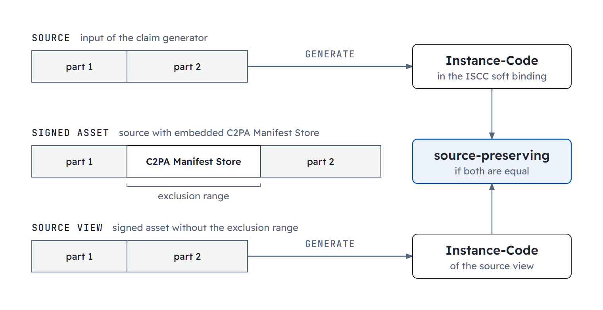
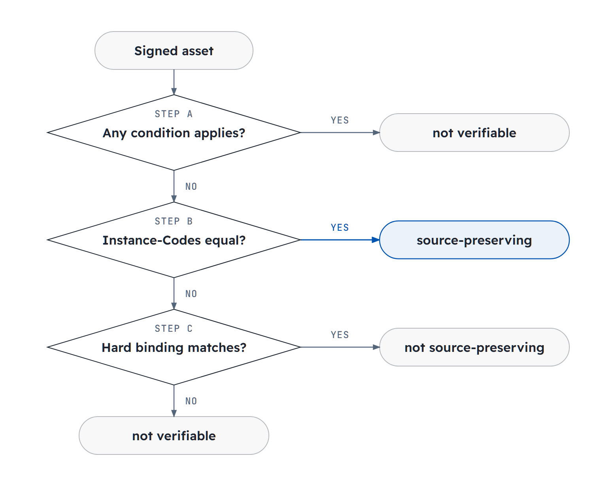

# ISCC C2PA Conformance

| IEP:      | 0020                                        |
| --------- | ------------------------------------------- |
| Title:    | ISCC C2PA Conformance                       |
| Author:   | Titusz Pan <tp@iscc.io>                     |
| Comments: | https://github.com/iscc/iscc-ieps/issues/28 |
| Status:   | Draft                                       |
| Type:     | Core                                        |
| Standard: | IEP                                         |
| License:  | CC-BY-4.0                                   |
| Created:  | {{ git_creation_date_localized }}           |
| Updated:  | {{ git_revision_date_localized }}           |

!!! note

    This document is a **DRAFT**. It specifies how the ISCC is used within the C2PA framework. This
    revision covers the value format of the C2PA soft binding algorithm `io.iscc.v0` (entry 3 of the
    [C2PA Soft Binding Algorithm List](https://github.com/c2pa-org/softbinding-algorithm-list)), the
    input from which its ISCC-UNITs are generated, and their verification against a signed asset. Later
    revisions will add further requirements, for example for resolution services.

## Introduction

A C2PA soft binding identifies content after its C2PA Manifest has been removed or the content has
been re-encoded. The C2PA Technical Specification leaves the value format of each soft binding
algorithm to the registry entry of that algorithm.

This document defines the value format of the registry entry `io.iscc.v0`. The value is an ISCC-SEQ,
a byte string of concatenated ISCC-UNITs. In a C2PA Manifest, the ISCC-UNITs are 256 bits long and
include at least a Data-Code and an Instance-Code. The C2PA Soft Binding Resolution API carries an
ISCC-SEQ in base64.

______________________________________________________________________

## Scope

This document specifies:

1. the ISCC-SEQ byte format and its decoding;
2. the value format of `c2pa.soft-binding` assertions with `alg` equal to `io.iscc.v0`;
3. the input from which the ISCC-UNITs of such an assertion are generated;
4. the verification of such an assertion against an asset, including whether the asset is
    source-preserving;
5. the value format of `io.iscc.v0` queries to the C2PA Soft Binding Resolution API.

The requirements apply to claim generators that write ISCC soft bindings and to validators and
resolvers that read them.

______________________________________________________________________

## Terminology

The terms ISCC-UNIT, ISCC-HEADER, ISCC-BODY, ISCC-CODE, MainType, SubType, Version and Length apply
as defined in ISO 24138:2024 and [IEP-0001](iep-0001.md). The terms soft binding, claim generator,
validator, resolver, C2PA Manifest, active manifest, C2PA Manifest Store, claim signature, hashed
URI, hard binding, data hash assertion and exclusion range apply as defined in the C2PA Technical
Specification.

**ISCC-SEQ** : byte string formed by concatenating one or more ISCC-UNITs, each encoded as its
ISCC-HEADER followed by its ISCC-BODY, without separators

**ISCC soft binding** : ISCC-SEQ that is a `blocks[].value` of a `c2pa.soft-binding` assertion with
`alg` equal to `io.iscc.v0`

**source** : complete byte stream into which a claim generator embeds a C2PA Manifest Store,
including any C2PA Manifest Store that the byte stream already contains

**source view** : byte stream formed by the bytes of a signed asset outside the exclusion ranges of
the data hash assertion of its active manifest

**source-preserving** : characterized by a source view that equals its source, byte for byte

______________________________________________________________________

## Soft Binding Value

### ISCC-SEQ Format

An ISCC-SEQ shall satisfy all of the following:

1. It shall consist of one or more ISCC-UNITs of MainType META (0), SEMANTIC (1), CONTENT (2), DATA
    (3) or INSTANCE (4).
2. Each ISCC-UNIT shall be encoded as its ISCC-HEADER immediately followed by its ISCC-BODY.
3. Each ISCC-HEADER shall use the variable-length nibble encoding of ISO 24138:2024, padded with one
    zero nibble where the number of nibbles is odd.
4. Each Length field shall have a value from 0 to 7. The ISCC-BODY then has 32 × (Length + 1) bits.
5. The ISCC-UNITs shall be concatenated without separators, length prefixes or trailing bytes.

The order of ISCC-UNITs is not significant. An ISCC-SEQ may contain several ISCC-UNITs with the same
MainType, SubType and Version.

For these MainTypes, the length of the ISCC-BODY depends on the Length field only. A decoder can
thus find the end of an ISCC-UNIT whose SubType or Version it does not know.

!!! note "NOTE"

    An ISCC-SEQ with one ISCC-UNIT is the byte encoding of that ISCC-UNIT as defined in ISO 24138:2024.
    For display, an ISCC-SEQ can be written as `ISCC:` followed by the base32 encoding of its bytes, in
    the same way as an ISCC-UNIT.

### Decoding

A decoder shall process an ISCC-SEQ from offset 0 as follows:

1. Decode the ISCC-HEADER at the current offset. Reject the ISCC-SEQ if the bytes end before the
    ISCC-HEADER is complete. Reject it also if the ISCC-HEADER bytes are not the encoding of the
    decoded fields as specified in ISCC-SEQ Format, item C.
2. Reject the ISCC-SEQ if ISCC-SEQ Format, item A does not permit the MainType, or if the Length
    field is greater than 7.
3. Reject the ISCC-SEQ if fewer bytes remain than the ISCC-BODY requires.
4. Output the ISCC-UNIT and move the offset to the end of its ISCC-BODY. If bytes remain, continue
    with step A.

A decoder shall not reject an ISCC-UNIT solely because its SubType or Version is unknown to it. A
decoder shall not alter, reorder or drop ISCC-UNITs.

### Assertion

A `c2pa.soft-binding` assertion that contains ISCC soft bindings shall satisfy Table 1.

**Table 1 – `c2pa.soft-binding` fields for `io.iscc.v0`**
{: style="text-align:center; font-size:smaller" }

| **Field**        | **Requirement**                                                         |
| ---------------- | ----------------------------------------------------------------------- |
| `alg`            | shall be `io.iscc.v0`                                                   |
| `blocks[].value` | shall be a CBOR byte string (major type 2) whose content is an ISCC-SEQ |
| `alg-params`     | shall be absent                                                         |

Each ISCC-UNIT of an ISCC soft binding shall have Version 0 and a 256-bit ISCC-BODY (Length field
equal to 7). A validator or resolver shall ignore, for matching, each ISCC-UNIT that it does not
support or whose ISCC-BODY is shorter than 256 bits.

!!! note "NOTE 1"

    Soft binding resolution is a lookup in a catalog of unlimited size. In such a catalog, shorter
    ISCC-UNITs of different content collide at random. [IEP-0013](iep-0013.md) uses 256-bit ISCC-UNITs
    for the same reason.

A claim generator shall include the Data-Code and the Instance-Code of the source in each ISCC soft
binding. It should also include one or more Content-Codes if the source contains text, image, audio
or video content. It may include a Semantic-Code and a Meta-Code.

!!! note "NOTE 2"

    The Data-Code and the Instance-Code can be generated for every file format. They identify the source
    at byte level. A re-encoded copy of the source has a different Data-Code and Instance-Code, but a
    similar Content-Code. This difference alone does not show that the ISCC soft binding does not match
    the copy.

!!! note "NOTE 3"

    ISO 24138:2024 does not define a Semantic-Code algorithm. The Version 0 Semantic-Codes for text and
    image are those of the reference implementations [iscc-sct](https://github.com/iscc/iscc-sct) and
    [iscc-sci](https://github.com/iscc/iscc-sci). They are generated with neural network models.
    Semantic-Codes that different implementations generate from the same content can thus differ in some
    bit positions.

!!! example "Whole-asset value with Meta-, Content-, Data- and Instance-Code (256 bits each)"

    `blocks[].value` is the 136-byte ISCC-SEQ of Test Vector 1. Its CBOR encoding starts with `58 88`
    (byte string, length 136). With the reference implementation:

    ```python
    import base64
    import iscc_core as ic

    units = [
        "ISCC:AADVPDD4R6733NMPFH3D57VTQ4KVH6VHL74XIWGUT37V5ZG56NV3NSI",  # Meta-Code
        "ISCC:EAD2RASIYU5IKLENP2OFI4CHZGRWYQCSW2WKX3Y6FJGOCXSYNYGLGBI",  # Content-Code Text
        "ISCC:GADQLNA7GRZESMRF2J7NZPNWGI3II2ST5YUN5SS6GVQ2ZQGJXPPYDNI",  # Data-Code
        "ISCC:IAD2KIVPJIWJZP3KQCESJL6SVT5APEZUPOJWM6HVTAXCF7OT3VFA4NY",  # Instance-Code
    ]

    # Claim generator: content of blocks[].value (CBOR byte string)
    value = ic.encode_seq(units)  # 136 bytes

    # Soft Binding Resolution API: value parameter or body member
    query = base64.b64encode(value).decode("ascii")  # RFC 4648 section 4, padded

    # Validator or resolver: back to ISCC-UNITs
    assert ic.decode_seq(value) == units
    assert ic.decode_seq(base64.b64decode(query)) == units

    # Display
    text = "ISCC:" + ic.encode_base32(value)
    ```

______________________________________________________________________

## Soft Binding Input

A claim generator shall generate each ISCC-UNIT of an ISCC soft binding, except a Meta-Code, from
the source. It shall process the source as a whole. It shall not remove, skip or normalize any part
of the source before generation. This includes a C2PA Manifest Store that the source already
contains.

A Meta-Code is generated from metadata. This document does not specify that metadata or its
verification.

!!! note "NOTE"

    If content is edited before it is signed, the source is the edited rendition that the claim
    generator signs. It is not the asset that was opened for editing.

______________________________________________________________________

## Verification

### Source Preservation

Figure 1 shows the relation between the source, the signed asset and the source view.

<figure markdown>
  
  <figcaption>Figure 1 – Source, signed asset and source view</figcaption>
</figure>

A validator that reports whether a signed asset is source-preserving shall apply the following steps
to the active manifest in the given order. It shall report the first result that applies.

1. Report *not verifiable* if one or more of these conditions apply:
    - the claim signature does not validate;
    - an assertion does not match its hashed URI in the claim;
    - the hard binding is not a data hash assertion (`c2pa.hash.data`);
    - no ISCC soft binding has an Instance-Code.
2. Report *source-preserving* if the Instance-Code generated from the source view equals the
    Instance-Code of an ISCC soft binding.
3. Report *not source-preserving* if the hard binding matches the asset.
4. Report *not verifiable*.

Step B is conclusive. The Instance-Code is a cryptographic hash of the source. Step A makes sure
that the claim signature protects the Instance-Code of the ISCC soft binding and the exclusion
ranges of the data hash assertion.

Figure 2 shows the steps as a flowchart.

<figure markdown>
  { width="700" }
  <figcaption>Figure 2 – Source preservation check</figcaption>
</figure>

!!! note "NOTE"

    *Not source-preserving* does not show a change after signing, because the hard binding matches. It
    shows that the embedding changed bytes outside the C2PA Manifest Store, or that the source already
    contained a C2PA Manifest Store, which the embedding replaces. BMFF-based and ZIP-based assets are
    always *not verifiable*, because their hard bindings are not data hash assertions.

### Soft Binding Verification

A validator that verifies an ISCC soft binding against an asset shall generate an ISCC-UNIT for each
ISCC-UNIT of the ISCC soft binding that it supports. The generated ISCC-UNIT shall have the same
MainType, SubType, Version and Length. The validator shall generate it from the input given in the
first row of Table 2 that applies to the asset.

**Table 2 – Input for the generation of ISCC-UNITs**
{: style="text-align:center; font-size:smaller" }

| **Asset**                                                      | **Data-Code, Instance-Code** | **Content-Code, Semantic-Code** |
| -------------------------------------------------------------- | ---------------------------- | ------------------------------- |
| source-preserving signed asset                                 | source view                  | source view                     |
| other signed asset whose hard binding is a data hash assertion | source view                  | asset                           |
| any other asset                                                | asset                        | asset                           |

The validator shall compare each Instance-Code of the ISCC soft binding with the generated
Instance-Code for equality. It shall compare each other ISCC-UNIT with its generated counterpart by
the number of bit positions in which their ISCC-BODYs differ. This document does not specify a
similarity threshold.

If the result for a signed asset is *not source-preserving*, the Data-Code and the Instance-Code of
the ISCC soft binding identify the source, not the signed asset. A validator should then show them
as codes of the source. It should not report their difference as a failed match.

!!! note "NOTE"

    The Data-Code and the Instance-Code are generated from all bytes of their input. The source view
    keeps the C2PA Manifest Store out of that input. The Content-Code and the Semantic-Code are
    generated from decoded content. A source view that differs from the source is not necessarily
    decodable, but the asset is. A source view that equals the source gives the ISCC-UNITs of the source
    exactly, also for formats in which the decoded content includes the C2PA Manifest Store.

______________________________________________________________________

## Soft Binding Resolution API

An `io.iscc.v0` query to the C2PA Soft Binding Resolution API shall satisfy all of the following:

1. The `alg` parameter or member shall be `io.iscc.v0`.
2. The `value` parameter of `GET /matches/byBinding` and the `value` member of the
    `POST /matches/byBinding` request body shall be the base64 encoding of an ISCC-SEQ as specified
    in RFC 4648 section 4, with padding characters.
3. In a `GET` request the base64 string shall be percent-encoded.

The ISCC-SEQ of a query should include a Data-Code and an Instance-Code.

______________________________________________________________________

## Security Considerations

In a C2PA Manifest, the claim signature protects the ISCC soft binding. An ISCC-SEQ has no integrity
protection of its own. The Decoding procedure rejects malformed byte strings and does not try to
repair them. It does not detect changes that keep the byte string well-formed.

Only the Instance-Code is a cryptographic hash. Equal 256-bit Instance-Codes show that two inputs
are identical. A match of any other ISCC-UNIT shows that two inputs are similar. It does not show
that they are identical.

The ISCC-UNITs of an ISCC soft binding are statements of the signer. The claim signature protects
them through the hashed URI of the soft binding assertion. The hard binding does not protect them.
The result *source-preserving* shows that the source view equals the source that the Instance-Code
identifies. It does not show that the signer generated the other ISCC-UNITs correctly. Soft Binding
Verification shows that.

______________________________________________________________________

## Reference Implementation

iscc-core, the reference implementation published with ISO 24138:2024, already decomposes the base32
form of concatenated ISCC-UNIT bytes into its ISCC-UNITs (`iscc_decompose`). Version 1.4.0 adds
`encode_seq` (ISCC-UNIT strings to ISCC-SEQ bytes) and `decode_seq` (ISCC-SEQ bytes to ISCC-UNIT
strings) as strict byte-level helpers, together with conformance test vectors. Entry 3 of the C2PA
Soft Binding Algorithm List shall reference this document as its `informationalUrl`.

The [ISCC C2PA Demo](https://github.com/iscc/iscc-c2pa-demo) is an open-source desktop application
and command line tool built on c2pa-rs, the C2PA SDK of the Content Authenticity Initiative. It
signs assets with ISCC soft bindings as specified in this document and performs the Source
Preservation check and Soft Binding Verification.

______________________________________________________________________

## Test Vectors

Conforming encoders shall produce, and conforming decoders shall accept, the following byte strings.

**Vector 1** – the four ISCC-UNITs of the example in Assertion, in the given order:

```text title="ISCC-SEQ bytes (hex)"
0007578c7c8fbfbdb58f29f63efeb3871553faa75ff97458d49eff5ee4ddf36bb6c92007a88248c53a852c8d7e9c547047c9a36c4052b6acabef1e2a4ce15e586e0cb305300705b41f3472493225d27edcbdb63236846a53ee28deca5e3561acc0c9bbdf81b54007a522af4a2c9cbf6a808924afd2acfa0793347b936678f5982e22fdd3dd4a0e37
```

```text title="Resolution API value (base64)"
AAdXjHyPv721jyn2Pv6zhxVT+qdf+XRY1J7/XuTd82u2ySAHqIJIxTqFLI1+nFRwR8mjbEBStqyr7x4qTOFeWG4MswUwBwW0HzRySTIl0n7cvbYyNoRqU+4o3speNWGswMm734G1QAelIq9KLJy/aoCJJK/SrPoHkzR7k2Z49ZguIv3T3UoONw==
```

**Vector 2** – mixed lengths with two CONTENT SubTypes, `ISCC:EEAYYNMFG5XOELK2` (Image, 64 bits),
`ISCC:EIBZ6B7T76PAAYP7H334X77754376` (Audio, 128 bits) and
`ISCC:GADQLNA7GRZESMRF2J7NZPNWGI3II2ST5YUN5SS6GVQ2ZQGJXPPYDNI` (Data, 256 bits):

```text title="ISCC-SEQ bytes (hex)"
21018c3585376ee22d5a22039f07f3ff9e0061ff3ef7cbffffef37ff300705b41f3472493225d27edcbdb63236846a53ee28deca5e3561acc0c9bbdf81b5
```

Conforming decoders shall reject the byte strings in Table 3.

**Table 3 – Byte strings that decoders shall reject**
{: style="text-align:center; font-size:smaller" }

| **Bytes (hex)**                                                        | **Reason**                                                  |
| ---------------------------------------------------------------------- | ----------------------------------------------------------- |
| (empty)                                                                | no ISCC-UNIT                                                |
| `28000100000000`                                                       | nonzero header padding nibble (valid form `28000000000000`) |
| `200800` followed by 36 zero bytes                                     | Length field 8                                              |
| `3000000000`                                                           | ISCC-BODY truncated (32-bit Data-Code with 3 body bytes)    |
| `30000000000000`                                                       | trailing byte after a complete ISCC-UNIT                    |
| `5005578c7c8fbfbdb58fa88248c53a852c8d05b41f3472493225a522af4a2c9cbf6a` | ISCC-CODE (MainType 5)                                      |
| `60100000000000000000`                                                 | ISCC-ID (MainType 6)                                        |

Conforming decoders shall accept `270000000000` (CONTENT, SubType 7, Version 0, 32 bits) and return
`ISCC:E4AAAAAAAA`, although SubType 7 is not defined by ISO 24138:2024.

!!! note "NOTE"

    Vector 2 and the 32-bit acceptance test exercise the ISCC-SEQ codec only. They are not conforming
    ISCC soft bindings, which require 256-bit ISCC-UNITs that include a Data-Code and an Instance-Code.

______________________________________________________________________

## References

### Normative

- [ISO 24138:2024](https://www.iso.org/standard/77899.html) - International Standard Content Code
- [IEP-0001](iep-0001.md) - ISCC Structure and Format
- [C2PA Technical Specification 2.4, Soft Binding assertion](https://spec.c2pa.org/specifications/specifications/2.4/specs/C2PA_Specification.html#soft_binding_assertion)
- [C2PA Technical Specification 2.4, Data Hash](https://spec.c2pa.org/specifications/specifications/2.4/specs/C2PA_Specification.html#_data_hash)
- [C2PA Soft Binding Resolution API 2.4](https://spec.c2pa.org/specifications/specifications/2.4/softbinding/Decoupled.html)
- [RFC 4648](https://www.rfc-editor.org/rfc/rfc4648) - The Base16, Base32, and Base64 Data Encodings
- [RFC 8949](https://www.rfc-editor.org/rfc/rfc8949) - Concise Binary Object Representation (CBOR)

### Informative

- [IEP-0013](iep-0013.md) - ISCC Discovery Protocol
- [C2PA Soft Binding Algorithm List](https://github.com/c2pa-org/softbinding-algorithm-list)
- [iscc-core](https://github.com/iscc/iscc-core) - Reference implementation
- [iscc-sct](https://github.com/iscc/iscc-sct) - Semantic-Code Text
- [iscc-sci](https://github.com/iscc/iscc-sci) - Semantic-Code Image
- [ISCC C2PA Demo](https://github.com/iscc/iscc-c2pa-demo) - Signing and verification
